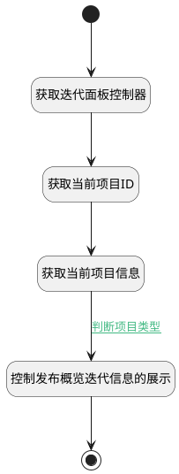

## 控制关联迭代 <!-- {docsify-ignore-all} -->

   根据项目类型控制发布概览中关联迭代面板的显示

### 处理过程




### 处理步骤说明

#### 开始 :id=Begin<sup class="footnote-symbol"> <font color=gray size=1>[开始]</font></sup>


#### 结束 :id=END1<sup class="footnote-symbol"> <font color=gray size=1>[结束]</font></sup>


#### 获取迭代面板控制器 :id=PREPAREJSPARAM1<sup class="footnote-symbol"> <font color=gray size=1>[准备参数]</font></sup>


1. 将`dashboard(部件).portlets.sprint` 设置给  `sprint(迭代看板部件)`

#### 获取当前项目ID :id=PREPAREJSPARAM3<sup class="footnote-symbol"> <font color=gray size=1>[准备参数]</font></sup>


1. 将`context(上下文变量).project` 设置给  `project(项目对象).id`

#### 获取当前项目信息 :id=DEACTION1<sup class="footnote-symbol"> <font color=gray size=1>[实体行为]</font></sup>


调用实体 [项目(PROJECT)](module/ProjMgmt/project.md) 行为 [Get](module/ProjMgmt/project#行为) ，行为参数为`project(项目对象)`

将执行结果返回给参数`project(项目对象)`

#### 控制发布概览迭代信息的展示 :id=PREPAREJSPARAM2<sup class="footnote-symbol"> <font color=gray size=1>[准备参数]</font></sup>


1. 将`false` 设置给  `sprint(迭代看板部件).state.visible`

### 连接条件说明
#### 判断项目类型 :id=DEACTION1-PREPAREJSPARAM2

(```project(项目对象).type``` EQ ```kanban``` OR ```project(项目对象).type``` EQ ```waterfall```)


### 实体逻辑参数

|    中文名   |    代码名    |  数据类型      |备注 |
| --------| --------| --------  | --------   |
|迭代看板部件|sprint|数据对象||
|项目对象|project|数据对象||
|上下文变量|context|导航视图参数绑定参数||
|部件|dashboard|当前部件对象||
|传入变量(<i class="fa fa-check"/></i>)|Default|数据对象||
