## 新建类别 <!-- {docsify-ignore-all} -->

   调用树节点新建方法新建类别

### 处理过程

```plantuml
@startuml
hide footbox
<style>
root {
  HyperlinkColor #42b983
}
</style>

hide empty description
state "开始" as Begin <<start>> [[$./create_category#begin {开始}]]
state "准备参数" as PREPAREJSPARAM1  [[$./create_category#preparejsparam1 {准备参数}]]
state "视图部件调用" as VIEWCTRLINVOKE1  [[$./create_category#viewctrlinvoke1 {视图部件调用}]]


Begin --> PREPAREJSPARAM1
PREPAREJSPARAM1 --> VIEWCTRLINVOKE1


@enduml
```

### 处理步骤说明

#### 开始 :id=Begin [开始]

#### 准备参数 :id=PREPAREJSPARAM1 [准备参数]

1. 将`node_2` 设置给  `node_param(节点参数).nodeType`
2. 将`context(上下文对象).project` 设置给  `defaultValue(默认值对象).owner_id`
3. 将`project` 设置给  `defaultValue(默认值对象).owner_type`
4. 将`release` 设置给  `defaultValue(默认值对象).owner_subtype`
5. 将`defaultValue(默认值对象)` 设置给  `node_param(节点参数).defaultValue`

#### 视图部件调用 :id=VIEWCTRLINVOKE1 [视图部件调用]

调用`treeexpbar_tree(树部件)`的方法`newTreeNode`，参数为`node_param(节点参数)`

### 实体逻辑参数

|    中文名   |    代码名    |  数据类型      |备注 |
| --------| --------| --------  | --------   |
|默认值对象|defaultValue|数据对象||
|节点参数|node_param|数据对象||
|树部件|treeexpbar_tree|部件对象||
|传入变量(<i class="fa fa-check"/></i>)|Default|数据对象||
|上下文对象|context|导航视图参数绑定参数||
