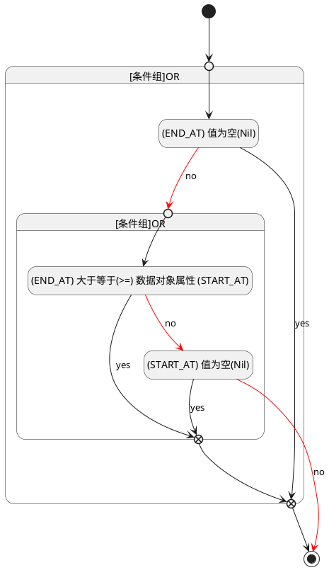

## 发布时间(END_AT) <!-- {docsify-ignore-all} -->

   

### 结束时间 :id=END_AT

#### 条件说明

##### (END_AT) 大于等于(>=) 数据对象属性 (START_AT) :id=a80c4daa62581a6b92bb47d0a0ea466f8

`END_AT(发布时间)` GTANDEQ  `START_AT`

> [!ATTENTION|label:规则信息|icon:fa fa-warning]
> 发布时间必须大于等于开始时间

##### (START_AT) 值为空(Nil) :id=a410434f561c9dbca92914f5ed9357016

`START_AT(开始时间)` ISNULL 

##### (END_AT) 值为空(Nil) :id=a156662053a1a4405d93715137cfad79a

`END_AT(发布时间)` ISNULL 

