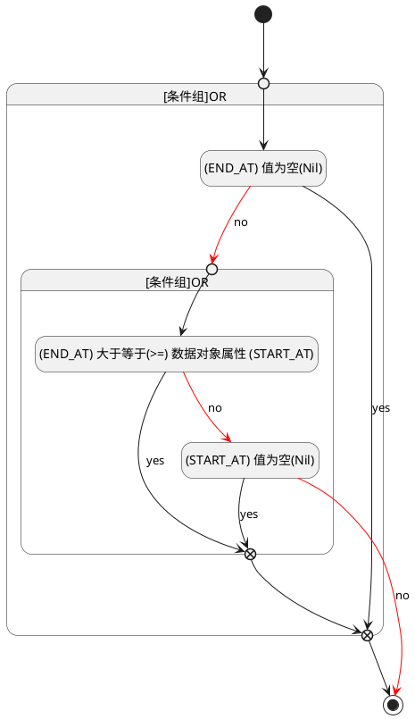

## 发布时间(END_AT) <!-- {docsify-ignore-all} -->

   

### 结束时间 :id=END_AT

#### 条件说明

##### (END_AT) 值为空(Nil) :id=a919a5ac4dda7d984365cc82608cac9a7

`END_AT(发布时间)` ISNULL 

##### (START_AT) 值为空(Nil) :id=a8e3fca521c7cb65218ccd7922dc9e9de

`START_AT(开始时间)` ISNULL 

##### (END_AT) 大于等于(>=) 数据对象属性 (START_AT) :id=a876f518c423c2a0a23cf896af52c3431

`END_AT(发布时间)` GTANDEQ  `START_AT`

> [!ATTENTION|label:规则信息|icon:fa fa-warning]
> 发布时间必须大于等于开始时间

