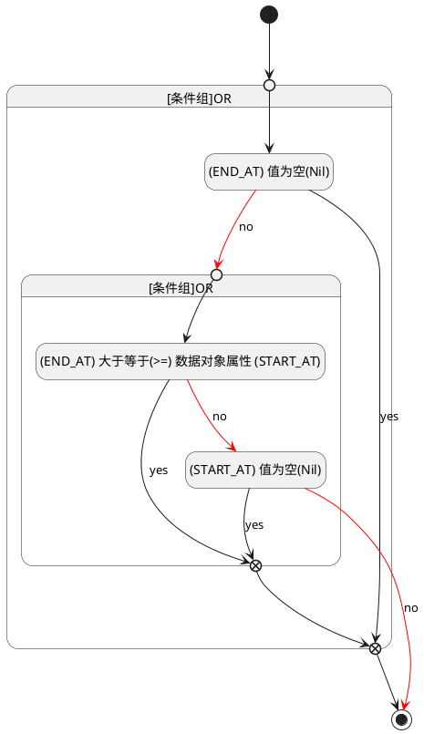

## 发布时间(END_AT) <!-- {docsify-ignore-all} -->

   

### 结束时间 :id=END_AT

```plantuml
@startuml
hide empty description
<style>
root {
  HyperlinkColor #42b983
}
</style>

state "start" as start  <<start>>
state "end" as end <<end>>
state "[条件组]OR" as 533d0ca45437df4044b7d13bdea4536f [[$./end_at#a533d0ca45437df4044b7d13bdea4536f {"[条件组]OR"}]] {
state " " as 533d0ca45437df4044b7d13bdea4536f_entry  <<entryPoint>>
state "(END_AT) 值为空(Nil)" as 6f27aebe49217d78ba384520357055fc [[$./end_at#a6f27aebe49217d78ba384520357055fc {"[常规条件] 值为空(Nil)"}]]
state "[条件组]OR" as 87c931f77c58d4702463af4fd19a34fb [[$./end_at#a87c931f77c58d4702463af4fd19a34fb {"[条件组]OR"}]] {
state " " as 87c931f77c58d4702463af4fd19a34fb_entry  <<entryPoint>>
state "(END_AT) 大于等于(>=) 数据对象属性 (START_AT)" as dfab5df519ad42e8a9cf7e58ad9cf3db [[$./end_at#adfab5df519ad42e8a9cf7e58ad9cf3db {"[常规条件] 大于等于(>=) 数据对象属性 (START_AT)"}]]
state "(START_AT) 值为空(Nil)" as d64f1cbbc00fa1e4dba4fc2e0ee905b3 [[$./end_at#ad64f1cbbc00fa1e4dba4fc2e0ee905b3 {"[常规条件] 值为空(Nil)"}]]
state " " as 87c931f77c58d4702463af4fd19a34fb_exit  <<exitPoint>>
}
state " " as 533d0ca45437df4044b7d13bdea4536f_exit  <<exitPoint>>
}


start --> 533d0ca45437df4044b7d13bdea4536f_entry 
533d0ca45437df4044b7d13bdea4536f_entry --> 6f27aebe49217d78ba384520357055fc 
6f27aebe49217d78ba384520357055fc --> 533d0ca45437df4044b7d13bdea4536f_exit  : yes
6f27aebe49217d78ba384520357055fc -[#red]-> 87c931f77c58d4702463af4fd19a34fb_entry  : no

87c931f77c58d4702463af4fd19a34fb_entry --> dfab5df519ad42e8a9cf7e58ad9cf3db 
dfab5df519ad42e8a9cf7e58ad9cf3db --> 87c931f77c58d4702463af4fd19a34fb_exit  : yes
dfab5df519ad42e8a9cf7e58ad9cf3db -[#red]-> d64f1cbbc00fa1e4dba4fc2e0ee905b3  : no

d64f1cbbc00fa1e4dba4fc2e0ee905b3 --> 87c931f77c58d4702463af4fd19a34fb_exit  : yes
d64f1cbbc00fa1e4dba4fc2e0ee905b3 -[#red]-> end  : no
87c931f77c58d4702463af4fd19a34fb_exit --> 533d0ca45437df4044b7d13bdea4536f_exit 
533d0ca45437df4044b7d13bdea4536f_exit --> end 


@enduml
```

#### 条件说明

##### (END_AT) 值为空(Nil) :id=a6f27aebe49217d78ba384520357055fc

`END_AT(发布时间)` ISNULL 

##### (START_AT) 值为空(Nil) :id=ad64f1cbbc00fa1e4dba4fc2e0ee905b3

`START_AT(开始时间)` ISNULL 

##### (END_AT) 大于等于(>=) 数据对象属性 (START_AT) :id=adfab5df519ad42e8a9cf7e58ad9cf3db

`END_AT(发布时间)` GTANDEQ  `START_AT`

> [!ATTENTION|label:规则信息|icon:fa fa-warning]
> 发布时间必须大于等于开始时间

