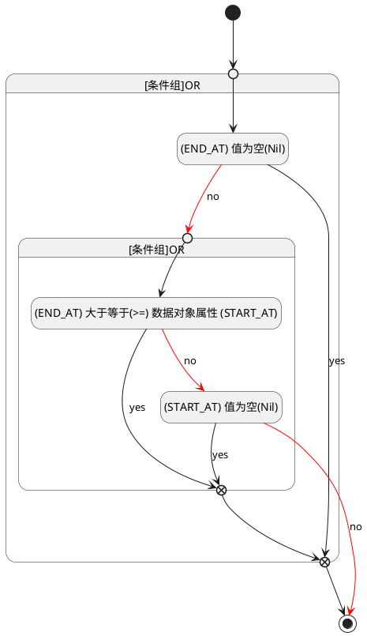

## 发布时间(END_AT) <!-- {docsify-ignore-all} -->

   

### 结束时间 :id=END_AT

```plantuml
@startuml
hide empty description
<style>
root {
  HyperlinkColor #42b983
}
</style>

state "start" as start  <<start>>
state "end" as end <<end>>
state "[条件组]OR" as 3677c5df31e8cb2d6dbe642730a240ac [[$./end_at#a3677c5df31e8cb2d6dbe642730a240ac {"[条件组]OR"}]] {
state " " as 3677c5df31e8cb2d6dbe642730a240ac_entry  <<entryPoint>>
state "(END_AT) 值为空(Nil)" as 57048b87905c1da6022646be822299d8 [[$./end_at#a57048b87905c1da6022646be822299d8 {"[常规条件] 值为空(Nil)"}]]
state "[条件组]OR" as ec660864a54a83f2af84ded70fbdbdd5 [[$./end_at#aec660864a54a83f2af84ded70fbdbdd5 {"[条件组]OR"}]] {
state " " as ec660864a54a83f2af84ded70fbdbdd5_entry  <<entryPoint>>
state "(END_AT) 大于等于(>=) 数据对象属性 (START_AT)" as 6d49045eb8527adcabd21a0384c18f5c [[$./end_at#a6d49045eb8527adcabd21a0384c18f5c {"[常规条件] 大于等于(>=) 数据对象属性 (START_AT)"}]]
state "(START_AT) 值为空(Nil)" as bb8b06d7dbf48e465ee2546c045aa21a [[$./end_at#abb8b06d7dbf48e465ee2546c045aa21a {"[常规条件] 值为空(Nil)"}]]
state " " as ec660864a54a83f2af84ded70fbdbdd5_exit  <<exitPoint>>
}
state " " as 3677c5df31e8cb2d6dbe642730a240ac_exit  <<exitPoint>>
}


start --> 3677c5df31e8cb2d6dbe642730a240ac_entry 
3677c5df31e8cb2d6dbe642730a240ac_entry --> 57048b87905c1da6022646be822299d8 
57048b87905c1da6022646be822299d8 --> 3677c5df31e8cb2d6dbe642730a240ac_exit  : yes
57048b87905c1da6022646be822299d8 -[#red]-> ec660864a54a83f2af84ded70fbdbdd5_entry  : no

ec660864a54a83f2af84ded70fbdbdd5_entry --> 6d49045eb8527adcabd21a0384c18f5c 
6d49045eb8527adcabd21a0384c18f5c --> ec660864a54a83f2af84ded70fbdbdd5_exit  : yes
6d49045eb8527adcabd21a0384c18f5c -[#red]-> bb8b06d7dbf48e465ee2546c045aa21a  : no

bb8b06d7dbf48e465ee2546c045aa21a --> ec660864a54a83f2af84ded70fbdbdd5_exit  : yes
bb8b06d7dbf48e465ee2546c045aa21a -[#red]-> end  : no
ec660864a54a83f2af84ded70fbdbdd5_exit --> 3677c5df31e8cb2d6dbe642730a240ac_exit 
3677c5df31e8cb2d6dbe642730a240ac_exit --> end 


@enduml
```

#### 条件说明

##### (START_AT) 值为空(Nil) :id=abb8b06d7dbf48e465ee2546c045aa21a

`START_AT(开始时间)` ISNULL 

##### (END_AT) 值为空(Nil) :id=a57048b87905c1da6022646be822299d8

`END_AT(发布时间)` ISNULL 

##### (END_AT) 大于等于(>=) 数据对象属性 (START_AT) :id=a6d49045eb8527adcabd21a0384c18f5c

`END_AT(发布时间)` GTANDEQ  `START_AT`

> [!ATTENTION|label:规则信息|icon:fa fa-warning]
> 发布时间必须大于等于开始时间

