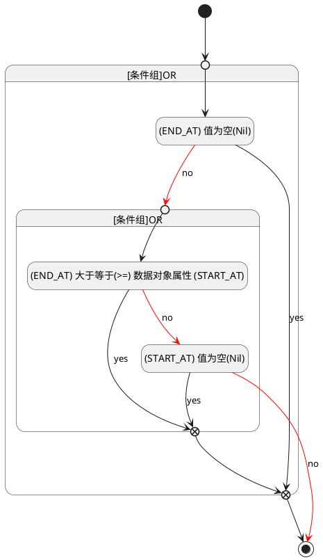

## 发布时间(END_AT) <!-- {docsify-ignore-all} -->

   

### 结束时间 :id=END_AT

```plantuml
@startuml
hide empty description
<style>
root {
  HyperlinkColor #42b983
}
</style>

state "start" as start  <<start>>
state "end" as end <<end>>
state "[条件组]OR" as e3127341bdf1a5c7370d2d216533f4e7 [[$./end_at#ae3127341bdf1a5c7370d2d216533f4e7 {"[条件组]OR"}]] {
state " " as e3127341bdf1a5c7370d2d216533f4e7_entry  <<entryPoint>>
state "(END_AT) 值为空(Nil)" as adc8626c97132f75eb9a6a99ce412dc9 [[$./end_at#aadc8626c97132f75eb9a6a99ce412dc9 {"[常规条件] 值为空(Nil)"}]]
state "[条件组]OR" as e7ace128be63c9c0eaaf5020cade28d6 [[$./end_at#ae7ace128be63c9c0eaaf5020cade28d6 {"[条件组]OR"}]] {
state " " as e7ace128be63c9c0eaaf5020cade28d6_entry  <<entryPoint>>
state "(END_AT) 大于等于(>=) 数据对象属性 (START_AT)" as 935e9273966da1e13a33f97a58debf75 [[$./end_at#a935e9273966da1e13a33f97a58debf75 {"[常规条件] 大于等于(>=) 数据对象属性 (START_AT)"}]]
state "(START_AT) 值为空(Nil)" as 304725685de0b2aabb3672f03dafc926 [[$./end_at#a304725685de0b2aabb3672f03dafc926 {"[常规条件] 值为空(Nil)"}]]
state " " as e7ace128be63c9c0eaaf5020cade28d6_exit  <<exitPoint>>
}
state " " as e3127341bdf1a5c7370d2d216533f4e7_exit  <<exitPoint>>
}


start --> e3127341bdf1a5c7370d2d216533f4e7_entry 
e3127341bdf1a5c7370d2d216533f4e7_entry --> adc8626c97132f75eb9a6a99ce412dc9 
adc8626c97132f75eb9a6a99ce412dc9 --> e3127341bdf1a5c7370d2d216533f4e7_exit  : yes
adc8626c97132f75eb9a6a99ce412dc9 -[#red]-> e7ace128be63c9c0eaaf5020cade28d6_entry  : no

e7ace128be63c9c0eaaf5020cade28d6_entry --> 935e9273966da1e13a33f97a58debf75 
935e9273966da1e13a33f97a58debf75 --> e7ace128be63c9c0eaaf5020cade28d6_exit  : yes
935e9273966da1e13a33f97a58debf75 -[#red]-> 304725685de0b2aabb3672f03dafc926  : no

304725685de0b2aabb3672f03dafc926 --> e7ace128be63c9c0eaaf5020cade28d6_exit  : yes
304725685de0b2aabb3672f03dafc926 -[#red]-> end  : no
e7ace128be63c9c0eaaf5020cade28d6_exit --> e3127341bdf1a5c7370d2d216533f4e7_exit 
e3127341bdf1a5c7370d2d216533f4e7_exit --> end 


@enduml
```

#### 条件说明

##### (END_AT) 值为空(Nil) :id=aadc8626c97132f75eb9a6a99ce412dc9

`END_AT(发布时间)` ISNULL 

##### (END_AT) 大于等于(>=) 数据对象属性 (START_AT) :id=a935e9273966da1e13a33f97a58debf75

`END_AT(发布时间)` GTANDEQ  `START_AT`

> [!ATTENTION|label:规则信息|icon:fa fa-warning]
> 发布时间必须大于等于开始时间

##### (START_AT) 值为空(Nil) :id=a304725685de0b2aabb3672f03dafc926

`START_AT(开始时间)` ISNULL 

