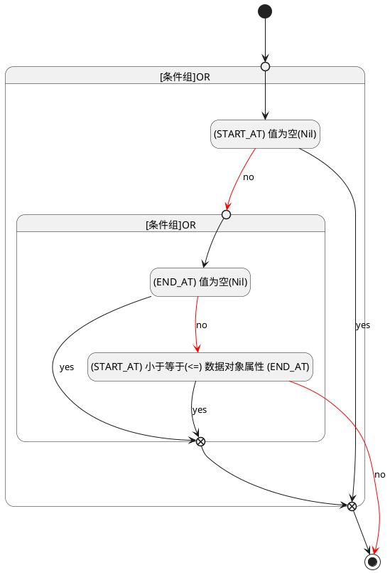

## 开始时间(START_AT) <!-- {docsify-ignore-all} -->

   

### 开始时间 :id=START_AT

#### 条件说明

##### (END_AT) 值为空(Nil) :id=aaa68c7d924ab1ad75e3009f87bb3b3eb

`END_AT(发布时间)` ISNULL 

##### (START_AT) 小于等于(<=) 数据对象属性 (END_AT) :id=a1edaaa03d123440abddaa1f629402058

`START_AT(开始时间)` LTANDEQ  `END_AT`

> [!ATTENTION|label:规则信息|icon:fa fa-warning]
> 开始时间必须小于等于发布时间

##### (START_AT) 值为空(Nil) :id=ab3f986b09b78dde77ca196bee94cc59d

`START_AT(开始时间)` ISNULL 

