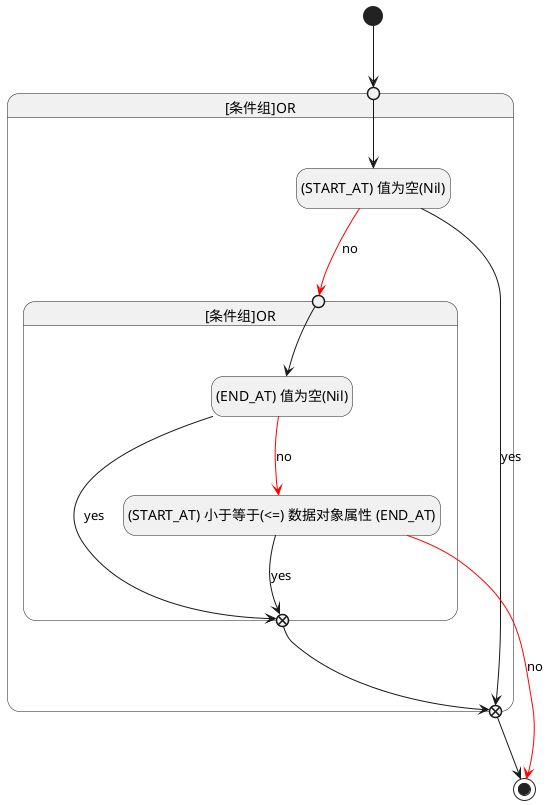

## 开始时间(START_AT) <!-- {docsify-ignore-all} -->

   

### 开始时间 :id=START_AT

#### 条件说明

##### (START_AT) 小于等于(<=) 数据对象属性 (END_AT) :id=a214b130699e5131455e21389033068ed

`START_AT(开始时间)` LTANDEQ  `END_AT`

> [!ATTENTION|label:规则信息|icon:fa fa-warning]
> 开始时间必须小于等于发布时间

##### (START_AT) 值为空(Nil) :id=a1c9da577ca8e33538584d2b59ce2fb44

`START_AT(开始时间)` ISNULL 

##### (END_AT) 值为空(Nil) :id=ad8ca47de814d01c8816fba8b9f46a02d

`END_AT(发布时间)` ISNULL 

