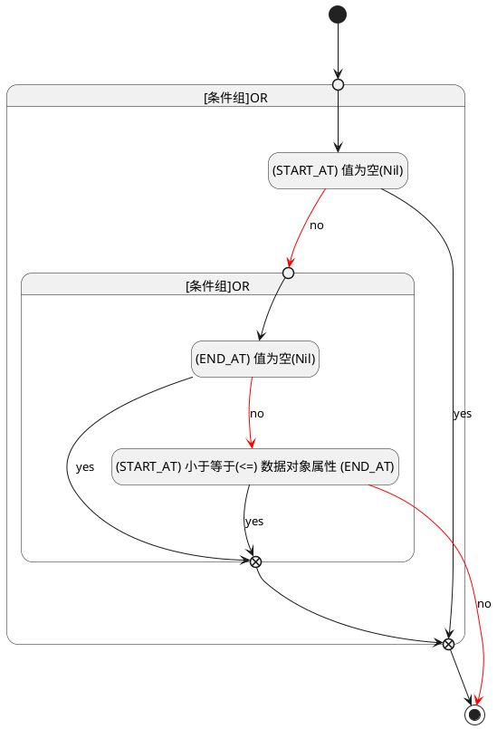

## 开始时间(START_AT) <!-- {docsify-ignore-all} -->

   

### 开始时间 :id=START_AT

#### 条件说明

##### (START_AT) 值为空(Nil) :id=a5eb34c61c1ce205f5c8afdecd6411937

`START_AT(开始时间)` ISNULL 

##### (END_AT) 值为空(Nil) :id=aa069e319a60d1c97a3064a2baf6e2596

`END_AT(发布时间)` ISNULL 

##### (START_AT) 小于等于(<=) 数据对象属性 (END_AT) :id=a41b979761a1d9e2cc8fb7f394ba8a02a

`START_AT(开始时间)` LTANDEQ  `END_AT`

> [!ATTENTION|label:规则信息|icon:fa fa-warning]
> 开始时间必须小于等于发布时间

