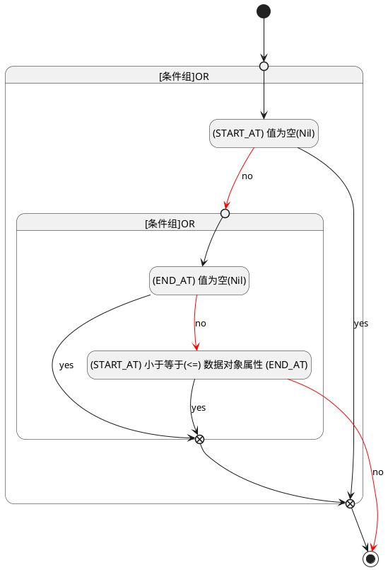

## 开始时间(START_AT) <!-- {docsify-ignore-all} -->

   

### 开始时间 :id=START_AT

#### 条件说明

##### (START_AT) 小于等于(<=) 数据对象属性 (END_AT) :id=a4c8b645c391675ce25ae73bdaf096a7f

`START_AT(开始时间)` LTANDEQ  `END_AT`

> [!ATTENTION|label:规则信息|icon:fa fa-warning]
> 开始时间必须小于等于发布时间

##### (END_AT) 值为空(Nil) :id=a01e962756381e4f517afbd8a733b6a10

`END_AT(发布时间)` ISNULL 

##### (START_AT) 值为空(Nil) :id=a8e86193934af96617ac3bd294419f3d4

`START_AT(开始时间)` ISNULL 

