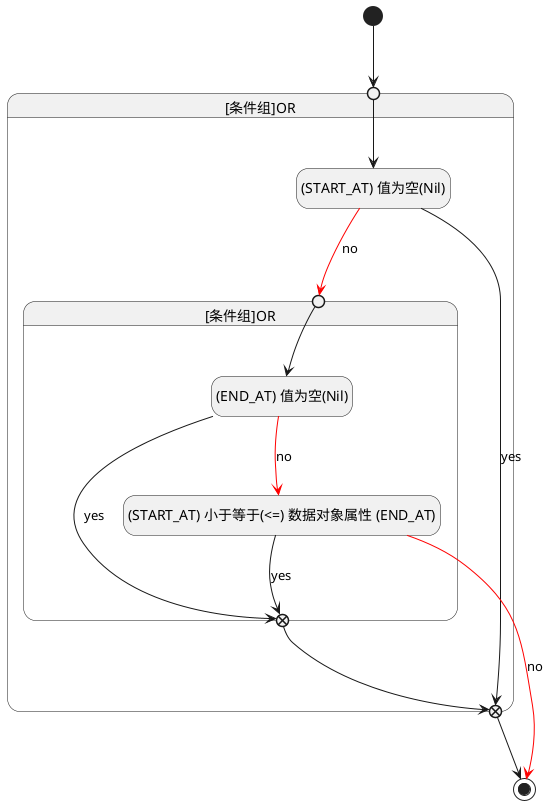

## 开始时间(START_AT) <!-- {docsify-ignore-all} -->

   

### 开始时间 :id=START_AT

```plantuml
@startuml
hide empty description
<style>
root {
  HyperlinkColor #42b983
}
</style>

state "start" as start  <<start>>
state "end" as end <<end>>
state "[条件组]OR" as 2d898ba109d37fb9c1932f05c5325170 [[$./start_at#a2d898ba109d37fb9c1932f05c5325170 {"[条件组]OR"}]] {
state " " as 2d898ba109d37fb9c1932f05c5325170_entry  <<entryPoint>>
state "(START_AT) 值为空(Nil)" as 65f824dd9a4fd52c083fdc629051ac40 [[$./start_at#a65f824dd9a4fd52c083fdc629051ac40 {"[常规条件] 值为空(Nil)"}]]
state "[条件组]OR" as c37826005c7d85372b3c150acd00f91b [[$./start_at#ac37826005c7d85372b3c150acd00f91b {"[条件组]OR"}]] {
state " " as c37826005c7d85372b3c150acd00f91b_entry  <<entryPoint>>
state "(END_AT) 值为空(Nil)" as 561a43c349a3cbb6b1e3b77fac1583f2 [[$./start_at#a561a43c349a3cbb6b1e3b77fac1583f2 {"[常规条件] 值为空(Nil)"}]]
state "(START_AT) 小于等于(<=) 数据对象属性 (END_AT)" as 0a5bf0f0bb5d851282e62a75fa1c02a3 [[$./start_at#a0a5bf0f0bb5d851282e62a75fa1c02a3 {"[常规条件] 小于等于(<=) 数据对象属性 (END_AT)"}]]
state " " as c37826005c7d85372b3c150acd00f91b_exit  <<exitPoint>>
}
state " " as 2d898ba109d37fb9c1932f05c5325170_exit  <<exitPoint>>
}


start --> 2d898ba109d37fb9c1932f05c5325170_entry 
2d898ba109d37fb9c1932f05c5325170_entry --> 65f824dd9a4fd52c083fdc629051ac40 
65f824dd9a4fd52c083fdc629051ac40 --> 2d898ba109d37fb9c1932f05c5325170_exit  : yes
65f824dd9a4fd52c083fdc629051ac40 -[#red]-> c37826005c7d85372b3c150acd00f91b_entry  : no

c37826005c7d85372b3c150acd00f91b_entry --> 561a43c349a3cbb6b1e3b77fac1583f2 
561a43c349a3cbb6b1e3b77fac1583f2 --> c37826005c7d85372b3c150acd00f91b_exit  : yes
561a43c349a3cbb6b1e3b77fac1583f2 -[#red]-> 0a5bf0f0bb5d851282e62a75fa1c02a3  : no

0a5bf0f0bb5d851282e62a75fa1c02a3 --> c37826005c7d85372b3c150acd00f91b_exit  : yes
0a5bf0f0bb5d851282e62a75fa1c02a3 -[#red]-> end  : no
c37826005c7d85372b3c150acd00f91b_exit --> 2d898ba109d37fb9c1932f05c5325170_exit 
2d898ba109d37fb9c1932f05c5325170_exit --> end 


@enduml
```

#### 条件说明

##### (END_AT) 值为空(Nil) :id=a561a43c349a3cbb6b1e3b77fac1583f2

`END_AT(发布时间)` ISNULL 

##### (START_AT) 小于等于(<=) 数据对象属性 (END_AT) :id=a0a5bf0f0bb5d851282e62a75fa1c02a3

`START_AT(开始时间)` LTANDEQ  `END_AT`

> [!ATTENTION|label:规则信息|icon:fa fa-warning]
> 开始时间必须小于等于发布时间

##### (START_AT) 值为空(Nil) :id=a65f824dd9a4fd52c083fdc629051ac40

`START_AT(开始时间)` ISNULL 

