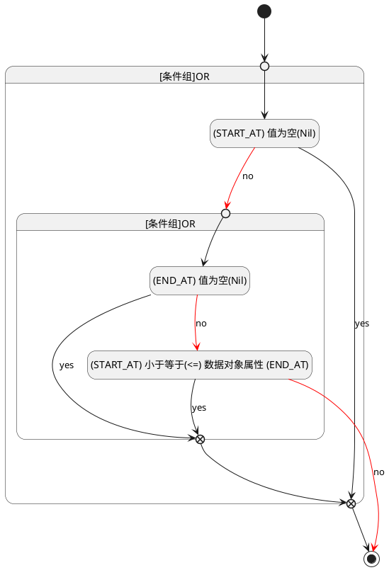

## 开始时间(START_AT) <!-- {docsify-ignore-all} -->

   

### 开始时间 :id=START_AT

```plantuml
@startuml
hide empty description
<style>
root {
  HyperlinkColor #42b983
}
</style>

state "start" as start  <<start>>
state "end" as end <<end>>
state "[条件组]OR" as e611324c2cc6759c83d375cb9c445790 [[$./start_at#ae611324c2cc6759c83d375cb9c445790 {"[条件组]OR"}]] {
state " " as e611324c2cc6759c83d375cb9c445790_entry  <<entryPoint>>
state "(START_AT) 值为空(Nil)" as 8fcfe33eaa3e05360ef740b42ae87047 [[$./start_at#a8fcfe33eaa3e05360ef740b42ae87047 {"[常规条件] 值为空(Nil)"}]]
state "[条件组]OR" as a5dab6dc4932a1331dff37091d935414 [[$./start_at#aa5dab6dc4932a1331dff37091d935414 {"[条件组]OR"}]] {
state " " as a5dab6dc4932a1331dff37091d935414_entry  <<entryPoint>>
state "(END_AT) 值为空(Nil)" as 12cd7f7c83f55dd2643d5bc593aaedbc [[$./start_at#a12cd7f7c83f55dd2643d5bc593aaedbc {"[常规条件] 值为空(Nil)"}]]
state "(START_AT) 小于等于(<=) 数据对象属性 (END_AT)" as cbccdef67a4ab4d2d6fd5a09ed5b2983 [[$./start_at#acbccdef67a4ab4d2d6fd5a09ed5b2983 {"[常规条件] 小于等于(<=) 数据对象属性 (END_AT)"}]]
state " " as a5dab6dc4932a1331dff37091d935414_exit  <<exitPoint>>
}
state " " as e611324c2cc6759c83d375cb9c445790_exit  <<exitPoint>>
}


start --> e611324c2cc6759c83d375cb9c445790_entry 
e611324c2cc6759c83d375cb9c445790_entry --> 8fcfe33eaa3e05360ef740b42ae87047 
8fcfe33eaa3e05360ef740b42ae87047 --> e611324c2cc6759c83d375cb9c445790_exit  : yes
8fcfe33eaa3e05360ef740b42ae87047 -[#red]-> a5dab6dc4932a1331dff37091d935414_entry  : no

a5dab6dc4932a1331dff37091d935414_entry --> 12cd7f7c83f55dd2643d5bc593aaedbc 
12cd7f7c83f55dd2643d5bc593aaedbc --> a5dab6dc4932a1331dff37091d935414_exit  : yes
12cd7f7c83f55dd2643d5bc593aaedbc -[#red]-> cbccdef67a4ab4d2d6fd5a09ed5b2983  : no

cbccdef67a4ab4d2d6fd5a09ed5b2983 --> a5dab6dc4932a1331dff37091d935414_exit  : yes
cbccdef67a4ab4d2d6fd5a09ed5b2983 -[#red]-> end  : no
a5dab6dc4932a1331dff37091d935414_exit --> e611324c2cc6759c83d375cb9c445790_exit 
e611324c2cc6759c83d375cb9c445790_exit --> end 


@enduml
```

#### 条件说明

##### (START_AT) 小于等于(<=) 数据对象属性 (END_AT) :id=acbccdef67a4ab4d2d6fd5a09ed5b2983

`START_AT(开始时间)` LTANDEQ  `END_AT`

> [!ATTENTION|label:规则信息|icon:fa fa-warning]
> 开始时间必须小于等于发布时间

##### (END_AT) 值为空(Nil) :id=a12cd7f7c83f55dd2643d5bc593aaedbc

`END_AT(发布时间)` ISNULL 

##### (START_AT) 值为空(Nil) :id=a8fcfe33eaa3e05360ef740b42ae87047

`START_AT(开始时间)` ISNULL 

