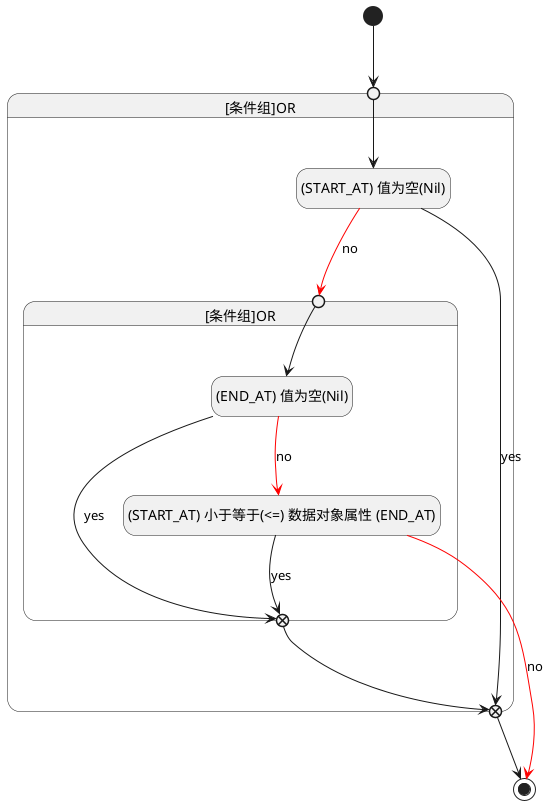

## 开始时间(START_AT) <!-- {docsify-ignore-all} -->

   

### 开始时间 :id=START_AT

```plantuml
@startuml
hide empty description
<style>
root {
  HyperlinkColor #42b983
}
</style>

state "start" as start  <<start>>
state "end" as end <<end>>
state "[条件组]OR" as d18c2a5302e02c06e7fc704f6f2208bd [[$./start_at#ad18c2a5302e02c06e7fc704f6f2208bd {"[条件组]OR"}]] {
state " " as d18c2a5302e02c06e7fc704f6f2208bd_entry  <<entryPoint>>
state "(START_AT) 值为空(Nil)" as d7b382e09e2183364b997dcb1ef80113 [[$./start_at#ad7b382e09e2183364b997dcb1ef80113 {"[常规条件] 值为空(Nil)"}]]
state "[条件组]OR" as 1a2962d581df960e85acf51dc7502aa8 [[$./start_at#a1a2962d581df960e85acf51dc7502aa8 {"[条件组]OR"}]] {
state " " as 1a2962d581df960e85acf51dc7502aa8_entry  <<entryPoint>>
state "(END_AT) 值为空(Nil)" as 8eda5347f5133041330d9043f30ab1b7 [[$./start_at#a8eda5347f5133041330d9043f30ab1b7 {"[常规条件] 值为空(Nil)"}]]
state "(START_AT) 小于等于(<=) 数据对象属性 (END_AT)" as 38bcc6c65dd82f516a52e1e8269b4695 [[$./start_at#a38bcc6c65dd82f516a52e1e8269b4695 {"[常规条件] 小于等于(<=) 数据对象属性 (END_AT)"}]]
state " " as 1a2962d581df960e85acf51dc7502aa8_exit  <<exitPoint>>
}
state " " as d18c2a5302e02c06e7fc704f6f2208bd_exit  <<exitPoint>>
}


start --> d18c2a5302e02c06e7fc704f6f2208bd_entry 
d18c2a5302e02c06e7fc704f6f2208bd_entry --> d7b382e09e2183364b997dcb1ef80113 
d7b382e09e2183364b997dcb1ef80113 --> d18c2a5302e02c06e7fc704f6f2208bd_exit  : yes
d7b382e09e2183364b997dcb1ef80113 -[#red]-> 1a2962d581df960e85acf51dc7502aa8_entry  : no

1a2962d581df960e85acf51dc7502aa8_entry --> 8eda5347f5133041330d9043f30ab1b7 
8eda5347f5133041330d9043f30ab1b7 --> 1a2962d581df960e85acf51dc7502aa8_exit  : yes
8eda5347f5133041330d9043f30ab1b7 -[#red]-> 38bcc6c65dd82f516a52e1e8269b4695  : no

38bcc6c65dd82f516a52e1e8269b4695 --> 1a2962d581df960e85acf51dc7502aa8_exit  : yes
38bcc6c65dd82f516a52e1e8269b4695 -[#red]-> end  : no
1a2962d581df960e85acf51dc7502aa8_exit --> d18c2a5302e02c06e7fc704f6f2208bd_exit 
d18c2a5302e02c06e7fc704f6f2208bd_exit --> end 


@enduml
```

#### 条件说明

##### (START_AT) 小于等于(<=) 数据对象属性 (END_AT) :id=a38bcc6c65dd82f516a52e1e8269b4695

`START_AT(开始时间)` LTANDEQ  `END_AT`

> [!ATTENTION|label:规则信息|icon:fa fa-warning]
> 开始时间必须小于等于发布时间

##### (END_AT) 值为空(Nil) :id=a8eda5347f5133041330d9043f30ab1b7

`END_AT(发布时间)` ISNULL 

##### (START_AT) 值为空(Nil) :id=ad7b382e09e2183364b997dcb1ef80113

`START_AT(开始时间)` ISNULL 

