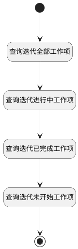

## 计算迭代工作项数量 <!-- {docsify-ignore-all} -->

   迭代工作项数量计算

### 处理过程




### 处理步骤说明

#### 开始 :id=Begin<sup class="footnote-symbol"> <font color=gray size=1>[开始]</font></sup>


*- N/A*
#### 查询迭代全部工作项 :id=RAWSQLCALL1<sup class="footnote-symbol"> <font color=gray size=1>[直接SQL调用]</font></sup>


<p class="panel-title"><b>执行sql语句</b></p>

```sql
select count(1) as `all` from work_item where IS_DELETED = '0' and SPRINT_ID = ?
```

<p class="panel-title"><b>执行sql参数</b></p>

1. `Default(传入变量).id(标识)`

重置参数`Default(传入变量)`，并将执行sql结果赋值给参数`Default(传入变量)`

#### 查询迭代进行中工作项 :id=RAWSQLCALL2<sup class="footnote-symbol"> <font color=gray size=1>[直接SQL调用]</font></sup>


<p class="panel-title"><b>执行sql语句</b></p>

```sql
select count(1) as `in_progress` from work_item where IS_DELETED = '0' and `STATE` IN ('20','30','32','34','36') and SPRINT_ID = ?
```

<p class="panel-title"><b>执行sql参数</b></p>

1. `Default(传入变量).id(标识)`

重置参数`Default(传入变量)`，并将执行sql结果赋值给参数`Default(传入变量)`

#### 查询迭代已完成工作项 :id=RAWSQLCALL3<sup class="footnote-symbol"> <font color=gray size=1>[直接SQL调用]</font></sup>


<p class="panel-title"><b>执行sql语句</b></p>

```sql
select count(1) as `completed` from work_item where IS_DELETED = '0' and `STATE` = '40' and SPRINT_ID = ?
```

<p class="panel-title"><b>执行sql参数</b></p>

1. `Default(传入变量).id(标识)`

重置参数`Default(传入变量)`，并将执行sql结果赋值给参数`Default(传入变量)`

#### 查询迭代未开始工作项 :id=RAWSQLCALL4<sup class="footnote-symbol"> <font color=gray size=1>[直接SQL调用]</font></sup>


<p class="panel-title"><b>执行sql语句</b></p>

```sql
select count(1) as `pending` from work_item where IS_DELETED = '0' and `STATE` IN ('10','14','16','50','60') and SPRINT_ID = ?
```

<p class="panel-title"><b>执行sql参数</b></p>

1. `Default(传入变量).id(标识)`

重置参数`Default(传入变量)`，并将执行sql结果赋值给参数`Default(传入变量)`

#### 结束 :id=END1<sup class="footnote-symbol"> <font color=gray size=1>[结束]</font></sup>


返回 `Default(传入变量)`


### 实体逻辑参数

|    中文名   |    代码名    |  数据类型    |  实体   |备注 |
| --------| --------| -------- | -------- | --------   |
|传入变量(<i class="fa fa-check"/></i>)|Default|数据对象|[迭代(SPRINT)](module/ProjMgmt/sprint.md)||
