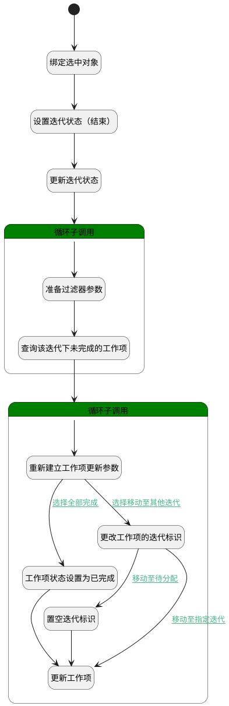

## 结束迭代 <!-- {docsify-ignore-all} -->

   结束迭代，根据用户选择，将未完成的工作项 移动至其他迭代会待分配

### 处理过程




### 处理步骤说明

#### 开始 :id=Begin<sup class="footnote-symbol"> <font color=gray size=1>[开始]</font></sup>


*- N/A*
#### 绑定选中对象 :id=BINDPARAM1<sup class="footnote-symbol"> <font color=gray size=1>[绑定参数]</font></sup>


绑定参数`Default(传入变量)` 到 `srfactionparam(选中对象)`
#### 设置迭代状态（结束） :id=PREPAREPARAM1<sup class="footnote-symbol"> <font color=gray size=1>[准备参数]</font></sup>


1. 将`3` 设置给  `Default(传入变量).STATUS(状态)`

#### 更新迭代状态 :id=DEACTION2<sup class="footnote-symbol"> <font color=gray size=1>[实体行为]</font></sup>


调用实体 [迭代(SPRINT)](module/ProjMgmt/sprint.md) 行为 [Update](module/ProjMgmt/sprint#行为) ，行为参数为`Default(传入变量)`

#### 工作项状态设置为已完成 :id=PREPAREPARAM2<sup class="footnote-symbol"> <font color=gray size=1>[准备参数]</font></sup>


1. 将`40` 设置给  `work_item_update_obj(工作项更新对象).STATE(状态)`
2. 将`for_work_item_temp(工作项循环临时变量).ID(标识)` 设置给  `work_item_update_obj(工作项更新对象).ID(标识)`

#### 更新工作项 :id=DEACTION1<sup class="footnote-symbol"> <font color=gray size=1>[实体行为]</font></sup>


调用实体 [工作项(WORK_ITEM)](module/ProjMgmt/work_item.md) 行为 [Update](module/ProjMgmt/work_item#行为) ，行为参数为`work_item_update_obj(工作项更新对象)`

#### 循环子调用 :id=LOOPSUBCALL1<sup class="footnote-symbol"> <font color=gray size=1>[循环子调用]</font></sup>


循环参数`srfactionparam(选中对象)`，子循环参数使用`for_sprint_temp(迭代循环临时变量)`
#### 准备过滤器参数 :id=PREPAREPARAM5<sup class="footnote-symbol"> <font color=gray size=1>[准备参数]</font></sup>


1. 将`for_sprint_temp(迭代循环临时变量).ID(标识)` 设置给  `work_item_filter(工作项过滤器).n_sprint_id_eq`
2. 将`for_sprint_temp(迭代循环临时变量).PROJECT_ID(项目标识)` 设置给  `work_item_filter(工作项过滤器).n_project_id_eq`

#### 查询该迭代下未完成的工作项 :id=DEDATASET1<sup class="footnote-symbol"> <font color=gray size=1>[实体数据集]</font></sup>


调用实体 [工作项(WORK_ITEM)](module/ProjMgmt/work_item.md) 数据集合 [正常状态(normal)](module/ProjMgmt/work_item#数据集合) ，查询参数为`work_item_filter(工作项过滤器)`

将执行结果返回给参数`work_item_page(工作项分页结果对象)`

#### 循环子调用 :id=LOOPSUBCALL2<sup class="footnote-symbol"> <font color=gray size=1>[循环子调用]</font></sup>


循环参数`work_item_page(工作项分页结果对象)`，子循环参数使用`for_work_item_temp(工作项循环临时变量)`
#### 重新建立工作项更新参数 :id=RENEWPARAM1<sup class="footnote-symbol"> <font color=gray size=1>[重新建立参数]</font></sup>


重建参数```work_item_update_obj(工作项更新对象)```
#### 更改工作项的迭代标识 :id=PREPAREPARAM3<sup class="footnote-symbol"> <font color=gray size=1>[准备参数]</font></sup>


1. 将`for_sprint_temp(迭代循环临时变量).target_sprint_id` 设置给  `work_item_update_obj(工作项更新对象).SPRINT_ID(迭代标识)`
2. 将`for_work_item_temp(工作项循环临时变量).ID(标识)` 设置给  `work_item_update_obj(工作项更新对象).ID(标识)`

#### 置空迭代标识 :id=PREPAREPARAM4<sup class="footnote-symbol"> <font color=gray size=1>[准备参数]</font></sup>


1. 将`空值（NULL）` 设置给  `work_item_update_obj(工作项更新对象).SPRINT_ID(迭代标识)`


### 连接条件说明
#### 选择全部完成 :id=RENEWPARAM1-PREPAREPARAM2

`for_sprint_temp(迭代循环临时变量).choose_finish` EQ `1`
#### 选择移动至其他迭代 :id=RENEWPARAM1-PREPAREPARAM3

`for_sprint_temp(迭代循环临时变量).choose_move` EQ `1`
#### 移动至待分配 :id=PREPAREPARAM3-PREPAREPARAM4

`work_item_update_obj(工作项更新对象).SPRINT_ID(迭代标识)` EQ `待分配工作项`
#### 移动至指定迭代 :id=PREPAREPARAM3-DEACTION1

`work_item_update_obj(工作项更新对象).SPRINT_ID(迭代标识)` NOTEQ `待分配工作项`


### 实体逻辑参数

|    中文名   |    代码名    |  数据类型    |  实体   |备注 |
| --------| --------| -------- | -------- | --------   |
|传入变量(<i class="fa fa-check"/></i>)|Default|数据对象|[迭代(SPRINT)](module/ProjMgmt/sprint.md)||
|迭代循环临时变量|for_sprint_temp|数据对象|[迭代(SPRINT)](module/ProjMgmt/sprint.md)||
|工作项循环临时变量|for_work_item_temp|数据对象|[工作项(WORK_ITEM)](module/ProjMgmt/work_item.md)||
|选中对象|srfactionparam|数据对象列表|[迭代(SPRINT)](module/ProjMgmt/sprint.md)||
|工作项过滤器|work_item_filter|过滤器|||
|工作项分页结果对象|work_item_page|分页查询|||
|工作项更新对象|work_item_update_obj|数据对象|[工作项(WORK_ITEM)](module/ProjMgmt/work_item.md)||
