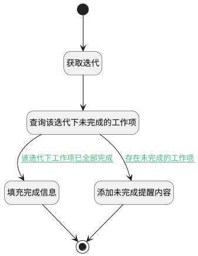

## 获取未完成的工作项数量 <!-- {docsify-ignore-all} -->

   完成迭代时，判断此迭代下是否存在未完成的工作项；提醒用户是否将未完成的工作项状态变更至已完成

### 处理过程




### 处理步骤说明

#### 开始 :id=Begin<sup class="footnote-symbol"> <font color=gray size=1>[开始]</font></sup>


*- N/A*
#### 获取迭代 :id=DEACTION1<sup class="footnote-symbol"> <font color=gray size=1>[实体行为]</font></sup>


调用实体 [迭代(SPRINT)](module/ProjMgmt/sprint.md) 行为 [Get](module/ProjMgmt/sprint#行为) ，行为参数为`Default(传入变量)`

将执行结果返回给参数`Default(传入变量)`

#### 查询该迭代下未完成的工作项 :id=RAWSQLCALL1<sup class="footnote-symbol"> <font color=gray size=1>[直接SQL调用]</font></sup>


<p class="panel-title"><b>执行sql语句</b></p>

```sql
select count(1) as not_finish_num from work_item where `state` <> '40' and sprint_id = ? and project_id = ?
```

<p class="panel-title"><b>执行sql参数</b></p>

1. `Default(传入变量).ID(标识)`
2. `Default(传入变量).project_id(项目标识)`

重置参数`Default(传入变量)`，并将执行sql结果赋值给参数`Default(传入变量)`

#### 添加未完成提醒内容 :id=RAWSFCODE1<sup class="footnote-symbol"> <font color=gray size=1>[直接后台代码]</font></sup>


<p class="panel-title"><b>执行代码[JavaScript]</b></p>

```javascript
var sprint = logic.getParam("Default");
var not_finish_num = sprint.get("not_finish_num");
sprint.set("remind", "该迭代仍有" + not_finish_num + "个工作项没有完成，将它们：");

```

#### 填充完成信息 :id=PREPAREPARAM1<sup class="footnote-symbol"> <font color=gray size=1>[准备参数]</font></sup>


1. 将`该迭代下工作项已全部完成` 设置给  `Default(传入变量).remind`

#### 结束 :id=END1<sup class="footnote-symbol"> <font color=gray size=1>[结束]</font></sup>


返回 `Default(传入变量)`


### 连接条件说明
#### 存在未完成的工作项 :id=RAWSQLCALL1-RAWSFCODE1

`Default(传入变量).not_finish_num` GT `0`
#### 该迭代下工作项已全部完成 :id=RAWSQLCALL1-PREPAREPARAM1

`Default(传入变量).not_finish_num` EQ `0`


### 实体逻辑参数

|    中文名   |    代码名    |  数据类型    |  实体   |备注 |
| --------| --------| -------- | -------- | --------   |
|传入变量(<i class="fa fa-check"/></i>)|Default|数据对象|[迭代(SPRINT)](module/ProjMgmt/sprint.md)||
