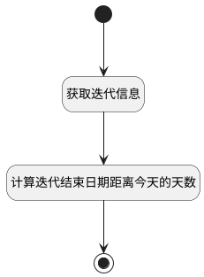

## 获取概览基本信息统计数字 <!-- {docsify-ignore-all} -->

   获取概览基本信息统计数字

### 处理过程




### 处理步骤说明

#### 开始 :id=Begin<sup class="footnote-symbol"> <font color=gray size=1>[开始]</font></sup>


*- N/A*
#### 获取迭代信息 :id=DEACTION1<sup class="footnote-symbol"> <font color=gray size=1>[实体行为]</font></sup>


调用实体 [迭代(SPRINT)](module/ProjMgmt/sprint.md) 行为 [Get](module/ProjMgmt/sprint#行为) ，行为参数为`Default(传入变量)`

将执行结果返回给参数`Default(传入变量)`

#### 计算迭代结束日期距离今天的天数 :id=RAWSFCODE1<sup class="footnote-symbol"> <font color=gray size=1>[直接后台代码]</font></sup>


<p class="panel-title"><b>执行代码[Groovy]</b></p>

```groovy
def _default = logic.param('default').getReal()
def daysDifference = 0
if(_default.get('end_at') != null){
    // 将 java.sql.Timestamp 转换为 java.time.LocalDateTime
    java.time.LocalDateTime targetDateTime = _default.get('end_at').toLocalDateTime();
     // 获取当前时间的 java.time.LocalDateTime 对象
    def currentDateTime = java.time.LocalDateTime.now()
    // 将 LocalDateTime 转换为 LocalDate，因为 LocalDateTime 不支持 toEpochDay() 方法
    def targetDate = targetDateTime.toLocalDate()
    def currentDate = currentDateTime.toLocalDate()
    // 计算目标日期与今天的天数差
    daysDifference = targetDate.toEpochDay() - currentDate.toEpochDay()
}
if(daysDifference < 0){
    daysDifference = 0
}
_default.set("date_num", daysDifference)
```

#### 结束 :id=END1<sup class="footnote-symbol"> <font color=gray size=1>[结束]</font></sup>


返回 `Default(传入变量)`


### 实体逻辑参数

|    中文名   |    代码名    |  数据类型    |  实体   |备注 |
| --------| --------| -------- | -------- | --------   |
|传入变量(<i class="fa fa-check"/></i>)|Default|数据对象|[迭代(SPRINT)](module/ProjMgmt/sprint.md)||
