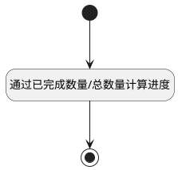

## 计算进度 <!-- {docsify-ignore-all} -->

   表格列计算进度

### 处理过程




### 处理步骤说明

#### 开始 :id=Begin<sup class="footnote-symbol"> <font color=gray size=1>[开始]</font></sup>


#### 通过已完成数量/总数量计算进度 :id=RAWJSCODE1<sup class="footnote-symbol"> <font color=gray size=1>[直接前台代码]</font></sup>


<p class="panel-title"><b>执行代码</b></p>

```javascript
const rows = uiLogic.grid.state.rows;
if (rows && rows.length > 0) {
	rows.forEach(row => {
        row.data.schedule = 0;
		const completed_work_items = row.data.completed_work_items;
        const all_work_items = row.data.all_work_items;
        if(all_work_items !== 0 && completed_work_items !== 0){
            row.data.schedule = Math.round((completed_work_items / all_work_items) * 100);
        }
	})
}
```

#### 结束 :id=END1<sup class="footnote-symbol"> <font color=gray size=1>[结束]</font></sup>


### 实体逻辑参数

|    中文名   |    代码名    |  数据类型      |备注 |
| --------| --------| --------  | --------   |
|表格对象|grid|当前部件对象||
|传入变量(<i class="fa fa-check"/></i>)|Default|数据对象||
