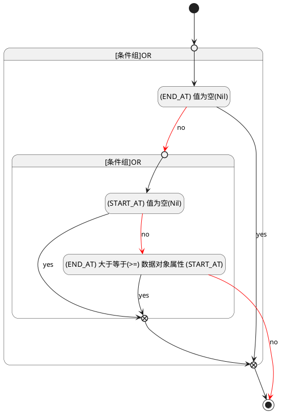

## 结束时间(END_AT) <!-- {docsify-ignore-all} -->

   

### 结束时间 :id=END_AT

#### 条件说明

##### (END_AT) 大于等于(>=) 数据对象属性 (START_AT) :id=a6eb2b9707e1a87350535149430fae709

`END_AT(结束时间)` GTANDEQ  `START_AT`

> [!ATTENTION|label:规则信息|icon:fa fa-warning]
> 结束时间必须大于等于开始时间

##### (END_AT) 值为空(Nil) :id=a99b25374c3b4608c6650b5fccfefa2b6

`END_AT(结束时间)` ISNULL 

##### (START_AT) 值为空(Nil) :id=a73626bd1279ed2bd04c6ebd7985d5172

`START_AT(开始时间)` ISNULL 

