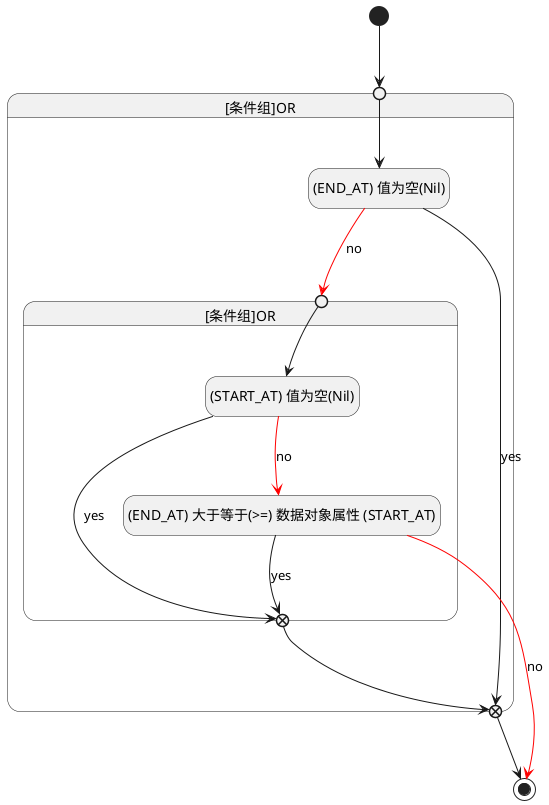

## 结束时间(END_AT) <!-- {docsify-ignore-all} -->

   

### 结束时间 :id=END_AT

```plantuml
@startuml
hide empty description
<style>
root {
  HyperlinkColor #42b983
}
</style>

state "start" as start  <<start>>
state "end" as end <<end>>
state "[条件组]OR" as ae12dc51786f1ddd0dc991148ad4236d [[$./end_at#aae12dc51786f1ddd0dc991148ad4236d {"[条件组]OR"}]] {
state " " as ae12dc51786f1ddd0dc991148ad4236d_entry  <<entryPoint>>
state "(END_AT) 值为空(Nil)" as 1ce3921e17c7bcb869b62b672018fa81 [[$./end_at#a1ce3921e17c7bcb869b62b672018fa81 {"[常规条件] 值为空(Nil)"}]]
state "[条件组]OR" as 06441b751fadda0599e49fb77b0ed145 [[$./end_at#a06441b751fadda0599e49fb77b0ed145 {"[条件组]OR"}]] {
state " " as 06441b751fadda0599e49fb77b0ed145_entry  <<entryPoint>>
state "(START_AT) 值为空(Nil)" as bb563af88386df25f8192d3d6a155071 [[$./end_at#abb563af88386df25f8192d3d6a155071 {"[常规条件] 值为空(Nil)"}]]
state "(END_AT) 大于等于(>=) 数据对象属性 (START_AT)" as df7f6c57700a83a1d18cb37d7aee2a07 [[$./end_at#adf7f6c57700a83a1d18cb37d7aee2a07 {"[常规条件] 大于等于(>=) 数据对象属性 (START_AT)"}]]
state " " as 06441b751fadda0599e49fb77b0ed145_exit  <<exitPoint>>
}
state " " as ae12dc51786f1ddd0dc991148ad4236d_exit  <<exitPoint>>
}


start --> ae12dc51786f1ddd0dc991148ad4236d_entry 
ae12dc51786f1ddd0dc991148ad4236d_entry --> 1ce3921e17c7bcb869b62b672018fa81 
1ce3921e17c7bcb869b62b672018fa81 --> ae12dc51786f1ddd0dc991148ad4236d_exit  : yes
1ce3921e17c7bcb869b62b672018fa81 -[#red]-> 06441b751fadda0599e49fb77b0ed145_entry  : no

06441b751fadda0599e49fb77b0ed145_entry --> bb563af88386df25f8192d3d6a155071 
bb563af88386df25f8192d3d6a155071 --> 06441b751fadda0599e49fb77b0ed145_exit  : yes
bb563af88386df25f8192d3d6a155071 -[#red]-> df7f6c57700a83a1d18cb37d7aee2a07  : no

df7f6c57700a83a1d18cb37d7aee2a07 --> 06441b751fadda0599e49fb77b0ed145_exit  : yes
df7f6c57700a83a1d18cb37d7aee2a07 -[#red]-> end  : no
06441b751fadda0599e49fb77b0ed145_exit --> ae12dc51786f1ddd0dc991148ad4236d_exit 
ae12dc51786f1ddd0dc991148ad4236d_exit --> end 


@enduml
```

#### 条件说明

##### (START_AT) 值为空(Nil) :id=abb563af88386df25f8192d3d6a155071

`START_AT(开始时间)` ISNULL 

##### (END_AT) 值为空(Nil) :id=a1ce3921e17c7bcb869b62b672018fa81

`END_AT(结束时间)` ISNULL 

##### (END_AT) 大于等于(>=) 数据对象属性 (START_AT) :id=adf7f6c57700a83a1d18cb37d7aee2a07

`END_AT(结束时间)` GTANDEQ  `START_AT`

> [!ATTENTION|label:规则信息|icon:fa fa-warning]
> 结束时间必须大于等于开始时间

