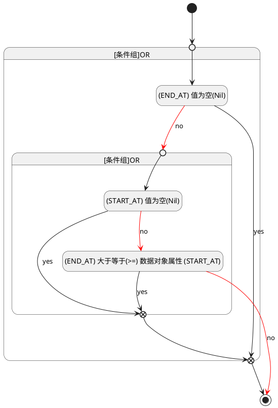

## 结束时间(END_AT) <!-- {docsify-ignore-all} -->

   

### 结束时间 :id=END_AT

```plantuml
@startuml
hide empty description
<style>
root {
  HyperlinkColor #42b983
}
</style>

state "start" as start  <<start>>
state "end" as end <<end>>
state "[条件组]OR" as d0458090090323c201734ad2136e5f25 [[$./end_at#ad0458090090323c201734ad2136e5f25 {"[条件组]OR"}]] {
state " " as d0458090090323c201734ad2136e5f25_entry  <<entryPoint>>
state "(END_AT) 值为空(Nil)" as a491b67d835896eb6a91afe53f7c5f7b [[$./end_at#aa491b67d835896eb6a91afe53f7c5f7b {"[常规条件] 值为空(Nil)"}]]
state "[条件组]OR" as ee7842dc59f9ec4ce05f24647df9b9c5 [[$./end_at#aee7842dc59f9ec4ce05f24647df9b9c5 {"[条件组]OR"}]] {
state " " as ee7842dc59f9ec4ce05f24647df9b9c5_entry  <<entryPoint>>
state "(START_AT) 值为空(Nil)" as 1d7955016a2d6734ff6016fcadf2346a [[$./end_at#a1d7955016a2d6734ff6016fcadf2346a {"[常规条件] 值为空(Nil)"}]]
state "(END_AT) 大于等于(>=) 数据对象属性 (START_AT)" as c9587b1f47ca7515abd9a1d624d624dc [[$./end_at#ac9587b1f47ca7515abd9a1d624d624dc {"[常规条件] 大于等于(>=) 数据对象属性 (START_AT)"}]]
state " " as ee7842dc59f9ec4ce05f24647df9b9c5_exit  <<exitPoint>>
}
state " " as d0458090090323c201734ad2136e5f25_exit  <<exitPoint>>
}


start --> d0458090090323c201734ad2136e5f25_entry 
d0458090090323c201734ad2136e5f25_entry --> a491b67d835896eb6a91afe53f7c5f7b 
a491b67d835896eb6a91afe53f7c5f7b --> d0458090090323c201734ad2136e5f25_exit  : yes
a491b67d835896eb6a91afe53f7c5f7b -[#red]-> ee7842dc59f9ec4ce05f24647df9b9c5_entry  : no

ee7842dc59f9ec4ce05f24647df9b9c5_entry --> 1d7955016a2d6734ff6016fcadf2346a 
1d7955016a2d6734ff6016fcadf2346a --> ee7842dc59f9ec4ce05f24647df9b9c5_exit  : yes
1d7955016a2d6734ff6016fcadf2346a -[#red]-> c9587b1f47ca7515abd9a1d624d624dc  : no

c9587b1f47ca7515abd9a1d624d624dc --> ee7842dc59f9ec4ce05f24647df9b9c5_exit  : yes
c9587b1f47ca7515abd9a1d624d624dc -[#red]-> end  : no
ee7842dc59f9ec4ce05f24647df9b9c5_exit --> d0458090090323c201734ad2136e5f25_exit 
d0458090090323c201734ad2136e5f25_exit --> end 


@enduml
```

#### 条件说明

##### (END_AT) 值为空(Nil) :id=aa491b67d835896eb6a91afe53f7c5f7b

`END_AT(结束时间)` ISNULL 

##### (START_AT) 值为空(Nil) :id=a1d7955016a2d6734ff6016fcadf2346a

`START_AT(开始时间)` ISNULL 

##### (END_AT) 大于等于(>=) 数据对象属性 (START_AT) :id=ac9587b1f47ca7515abd9a1d624d624dc

`END_AT(结束时间)` GTANDEQ  `START_AT`

> [!ATTENTION|label:规则信息|icon:fa fa-warning]
> 结束时间必须大于等于开始时间

