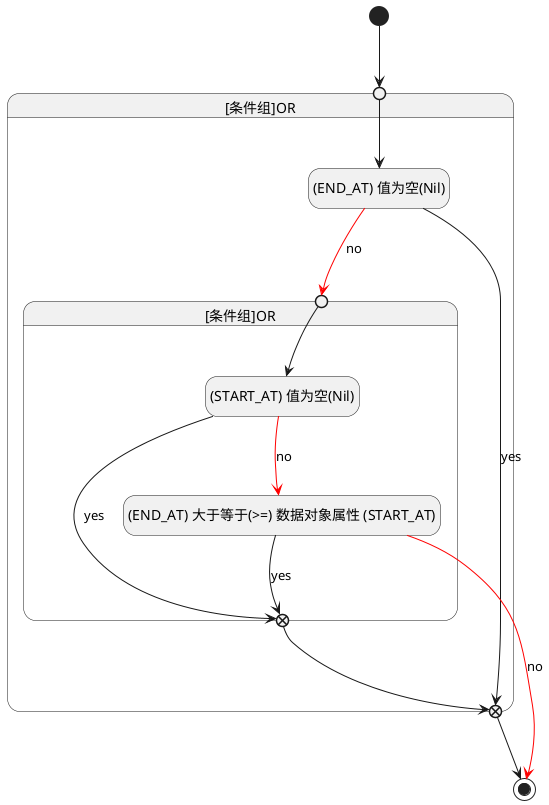

## 结束时间(END_AT) <!-- {docsify-ignore-all} -->

   

### 结束时间 :id=END_AT

```plantuml
@startuml
hide empty description
<style>
root {
  HyperlinkColor #42b983
}
</style>

state "start" as start  <<start>>
state "end" as end <<end>>
state "[条件组]OR" as bf8ae0d7acdc1995c6eca222407ec340 [[$./end_at#abf8ae0d7acdc1995c6eca222407ec340 {"[条件组]OR"}]] {
state " " as bf8ae0d7acdc1995c6eca222407ec340_entry  <<entryPoint>>
state "(END_AT) 值为空(Nil)" as acfc20ae413732863982640f64d1d4a4 [[$./end_at#aacfc20ae413732863982640f64d1d4a4 {"[常规条件] 值为空(Nil)"}]]
state "[条件组]OR" as eee533b37de85cf85313eaec60232766 [[$./end_at#aeee533b37de85cf85313eaec60232766 {"[条件组]OR"}]] {
state " " as eee533b37de85cf85313eaec60232766_entry  <<entryPoint>>
state "(START_AT) 值为空(Nil)" as 19c08bc3b7f26dceb2b6269dac936240 [[$./end_at#a19c08bc3b7f26dceb2b6269dac936240 {"[常规条件] 值为空(Nil)"}]]
state "(END_AT) 大于等于(>=) 数据对象属性 (START_AT)" as 588b948fefb819d25315415fecfbab49 [[$./end_at#a588b948fefb819d25315415fecfbab49 {"[常规条件] 大于等于(>=) 数据对象属性 (START_AT)"}]]
state " " as eee533b37de85cf85313eaec60232766_exit  <<exitPoint>>
}
state " " as bf8ae0d7acdc1995c6eca222407ec340_exit  <<exitPoint>>
}


start --> bf8ae0d7acdc1995c6eca222407ec340_entry 
bf8ae0d7acdc1995c6eca222407ec340_entry --> acfc20ae413732863982640f64d1d4a4 
acfc20ae413732863982640f64d1d4a4 --> bf8ae0d7acdc1995c6eca222407ec340_exit  : yes
acfc20ae413732863982640f64d1d4a4 -[#red]-> eee533b37de85cf85313eaec60232766_entry  : no

eee533b37de85cf85313eaec60232766_entry --> 19c08bc3b7f26dceb2b6269dac936240 
19c08bc3b7f26dceb2b6269dac936240 --> eee533b37de85cf85313eaec60232766_exit  : yes
19c08bc3b7f26dceb2b6269dac936240 -[#red]-> 588b948fefb819d25315415fecfbab49  : no

588b948fefb819d25315415fecfbab49 --> eee533b37de85cf85313eaec60232766_exit  : yes
588b948fefb819d25315415fecfbab49 -[#red]-> end  : no
eee533b37de85cf85313eaec60232766_exit --> bf8ae0d7acdc1995c6eca222407ec340_exit 
bf8ae0d7acdc1995c6eca222407ec340_exit --> end 


@enduml
```

#### 条件说明

##### (START_AT) 值为空(Nil) :id=a19c08bc3b7f26dceb2b6269dac936240

`START_AT(开始时间)` ISNULL 

##### (END_AT) 值为空(Nil) :id=aacfc20ae413732863982640f64d1d4a4

`END_AT(结束时间)` ISNULL 

##### (END_AT) 大于等于(>=) 数据对象属性 (START_AT) :id=a588b948fefb819d25315415fecfbab49

`END_AT(结束时间)` GTANDEQ  `START_AT`

> [!ATTENTION|label:规则信息|icon:fa fa-warning]
> 结束时间必须大于等于开始时间

