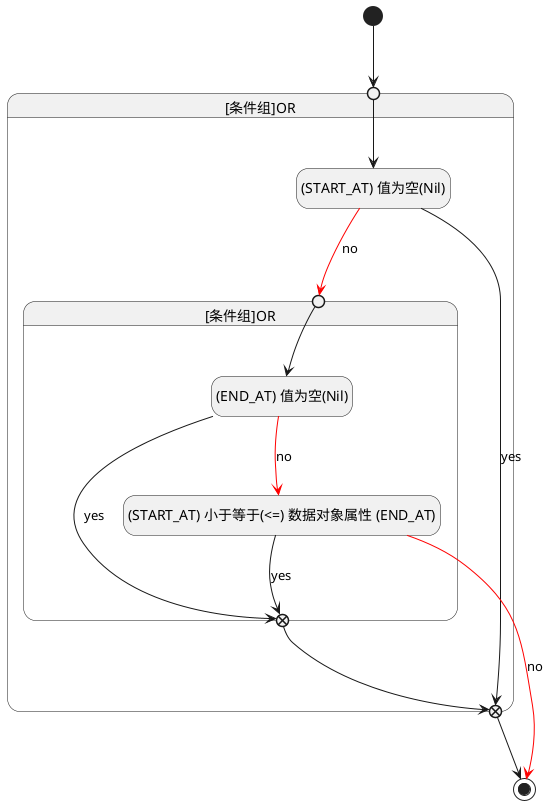

## 开始时间(START_AT) <!-- {docsify-ignore-all} -->

   

### 开始时间 :id=START_AT

```plantuml
@startuml
hide empty description
<style>
root {
  HyperlinkColor #42b983
}
</style>

state "start" as start  <<start>>
state "end" as end <<end>>
state "[条件组]OR" as 181bffb5c080d01914dce59393387559 [[$./start_at#a181bffb5c080d01914dce59393387559 {"[条件组]OR"}]] {
state " " as 181bffb5c080d01914dce59393387559_entry  <<entryPoint>>
state "(START_AT) 值为空(Nil)" as 0313a20b3a1c22f36a22ad2ff7e6b2bc [[$./start_at#a0313a20b3a1c22f36a22ad2ff7e6b2bc {"[常规条件] 值为空(Nil)"}]]
state "[条件组]OR" as fbbdeba5941683fd3a6d0ec1bd16e8cd [[$./start_at#afbbdeba5941683fd3a6d0ec1bd16e8cd {"[条件组]OR"}]] {
state " " as fbbdeba5941683fd3a6d0ec1bd16e8cd_entry  <<entryPoint>>
state "(END_AT) 值为空(Nil)" as 9b40277ba37e2dd8aa26dfd3f121152c [[$./start_at#a9b40277ba37e2dd8aa26dfd3f121152c {"[常规条件] 值为空(Nil)"}]]
state "(START_AT) 小于等于(<=) 数据对象属性 (END_AT)" as eb9d7d2300f151961f29ab3bd8542994 [[$./start_at#aeb9d7d2300f151961f29ab3bd8542994 {"[常规条件] 小于等于(<=) 数据对象属性 (END_AT)"}]]
state " " as fbbdeba5941683fd3a6d0ec1bd16e8cd_exit  <<exitPoint>>
}
state " " as 181bffb5c080d01914dce59393387559_exit  <<exitPoint>>
}


start --> 181bffb5c080d01914dce59393387559_entry 
181bffb5c080d01914dce59393387559_entry --> 0313a20b3a1c22f36a22ad2ff7e6b2bc 
0313a20b3a1c22f36a22ad2ff7e6b2bc --> 181bffb5c080d01914dce59393387559_exit  : yes
0313a20b3a1c22f36a22ad2ff7e6b2bc -[#red]-> fbbdeba5941683fd3a6d0ec1bd16e8cd_entry  : no

fbbdeba5941683fd3a6d0ec1bd16e8cd_entry --> 9b40277ba37e2dd8aa26dfd3f121152c 
9b40277ba37e2dd8aa26dfd3f121152c --> fbbdeba5941683fd3a6d0ec1bd16e8cd_exit  : yes
9b40277ba37e2dd8aa26dfd3f121152c -[#red]-> eb9d7d2300f151961f29ab3bd8542994  : no

eb9d7d2300f151961f29ab3bd8542994 --> fbbdeba5941683fd3a6d0ec1bd16e8cd_exit  : yes
eb9d7d2300f151961f29ab3bd8542994 -[#red]-> end  : no
fbbdeba5941683fd3a6d0ec1bd16e8cd_exit --> 181bffb5c080d01914dce59393387559_exit 
181bffb5c080d01914dce59393387559_exit --> end 


@enduml
```

#### 条件说明

##### (END_AT) 值为空(Nil) :id=a9b40277ba37e2dd8aa26dfd3f121152c

`END_AT(结束时间)` ISNULL 

##### (START_AT) 小于等于(<=) 数据对象属性 (END_AT) :id=aeb9d7d2300f151961f29ab3bd8542994

`START_AT(开始时间)` LTANDEQ  `END_AT`

> [!ATTENTION|label:规则信息|icon:fa fa-warning]
> 开始时间必须小于等于结束时间

##### (START_AT) 值为空(Nil) :id=a0313a20b3a1c22f36a22ad2ff7e6b2bc

`START_AT(开始时间)` ISNULL 

