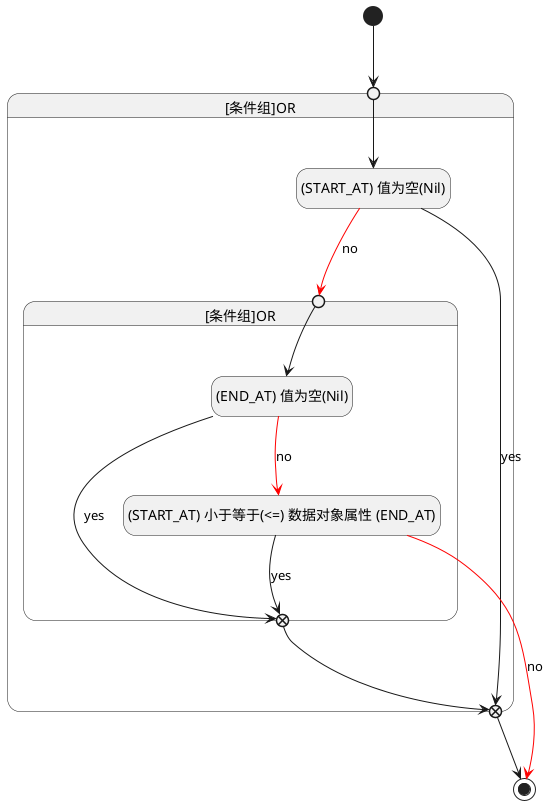

## 开始时间(START_AT) <!-- {docsify-ignore-all} -->

   

### 开始时间 :id=START_AT

```plantuml
@startuml
hide empty description
<style>
root {
  HyperlinkColor #42b983
}
</style>

state "start" as start  <<start>>
state "end" as end <<end>>
state "[条件组]OR" as 169bafbb0a68c03876acb7e6c8956587 [[$./start_at#a169bafbb0a68c03876acb7e6c8956587 {"[条件组]OR"}]] {
state " " as 169bafbb0a68c03876acb7e6c8956587_entry  <<entryPoint>>
state "(START_AT) 值为空(Nil)" as 073b0f2a061adac1963dcfc269b5e848 [[$./start_at#a073b0f2a061adac1963dcfc269b5e848 {"[常规条件] 值为空(Nil)"}]]
state "[条件组]OR" as 7bbdbe701b08e9adb56ffb7d40134387 [[$./start_at#a7bbdbe701b08e9adb56ffb7d40134387 {"[条件组]OR"}]] {
state " " as 7bbdbe701b08e9adb56ffb7d40134387_entry  <<entryPoint>>
state "(END_AT) 值为空(Nil)" as c59c37b471d1b22915112a3dd476a614 [[$./start_at#ac59c37b471d1b22915112a3dd476a614 {"[常规条件] 值为空(Nil)"}]]
state "(START_AT) 小于等于(<=) 数据对象属性 (END_AT)" as 5e81b51c9c3de88c9891fc6eba1bdd5e [[$./start_at#a5e81b51c9c3de88c9891fc6eba1bdd5e {"[常规条件] 小于等于(<=) 数据对象属性 (END_AT)"}]]
state " " as 7bbdbe701b08e9adb56ffb7d40134387_exit  <<exitPoint>>
}
state " " as 169bafbb0a68c03876acb7e6c8956587_exit  <<exitPoint>>
}


start --> 169bafbb0a68c03876acb7e6c8956587_entry 
169bafbb0a68c03876acb7e6c8956587_entry --> 073b0f2a061adac1963dcfc269b5e848 
073b0f2a061adac1963dcfc269b5e848 --> 169bafbb0a68c03876acb7e6c8956587_exit  : yes
073b0f2a061adac1963dcfc269b5e848 -[#red]-> 7bbdbe701b08e9adb56ffb7d40134387_entry  : no

7bbdbe701b08e9adb56ffb7d40134387_entry --> c59c37b471d1b22915112a3dd476a614 
c59c37b471d1b22915112a3dd476a614 --> 7bbdbe701b08e9adb56ffb7d40134387_exit  : yes
c59c37b471d1b22915112a3dd476a614 -[#red]-> 5e81b51c9c3de88c9891fc6eba1bdd5e  : no

5e81b51c9c3de88c9891fc6eba1bdd5e --> 7bbdbe701b08e9adb56ffb7d40134387_exit  : yes
5e81b51c9c3de88c9891fc6eba1bdd5e -[#red]-> end  : no
7bbdbe701b08e9adb56ffb7d40134387_exit --> 169bafbb0a68c03876acb7e6c8956587_exit 
169bafbb0a68c03876acb7e6c8956587_exit --> end 


@enduml
```

#### 条件说明

##### (END_AT) 值为空(Nil) :id=ac59c37b471d1b22915112a3dd476a614

`END_AT(结束时间)` ISNULL 

##### (START_AT) 值为空(Nil) :id=a073b0f2a061adac1963dcfc269b5e848

`START_AT(开始时间)` ISNULL 

##### (START_AT) 小于等于(<=) 数据对象属性 (END_AT) :id=a5e81b51c9c3de88c9891fc6eba1bdd5e

`START_AT(开始时间)` LTANDEQ  `END_AT`

> [!ATTENTION|label:规则信息|icon:fa fa-warning]
> 开始时间必须小于等于结束时间

