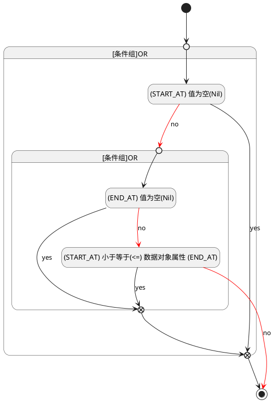

## 开始时间(START_AT) <!-- {docsify-ignore-all} -->

   

### 开始时间 :id=START_AT

```plantuml
@startuml
hide empty description
<style>
root {
  HyperlinkColor #42b983
}
</style>

state "start" as start  <<start>>
state "end" as end <<end>>
state "[条件组]OR" as a5859b55316916b69dc4fedb3f7aa6ce [[$./start_at#aa5859b55316916b69dc4fedb3f7aa6ce {"[条件组]OR"}]] {
state " " as a5859b55316916b69dc4fedb3f7aa6ce_entry  <<entryPoint>>
state "(START_AT) 值为空(Nil)" as c6bb47c90cc1def82ecda6ab242a67e2 [[$./start_at#ac6bb47c90cc1def82ecda6ab242a67e2 {"[常规条件] 值为空(Nil)"}]]
state "[条件组]OR" as a7d62201480e2942530aeffc6cddf2d1 [[$./start_at#aa7d62201480e2942530aeffc6cddf2d1 {"[条件组]OR"}]] {
state " " as a7d62201480e2942530aeffc6cddf2d1_entry  <<entryPoint>>
state "(END_AT) 值为空(Nil)" as 876ad84bc7a5954be84c8acd9ed5bb6c [[$./start_at#a876ad84bc7a5954be84c8acd9ed5bb6c {"[常规条件] 值为空(Nil)"}]]
state "(START_AT) 小于等于(<=) 数据对象属性 (END_AT)" as 2103dfd9159d28b8a76e04c08b074093 [[$./start_at#a2103dfd9159d28b8a76e04c08b074093 {"[常规条件] 小于等于(<=) 数据对象属性 (END_AT)"}]]
state " " as a7d62201480e2942530aeffc6cddf2d1_exit  <<exitPoint>>
}
state " " as a5859b55316916b69dc4fedb3f7aa6ce_exit  <<exitPoint>>
}


start --> a5859b55316916b69dc4fedb3f7aa6ce_entry 
a5859b55316916b69dc4fedb3f7aa6ce_entry --> c6bb47c90cc1def82ecda6ab242a67e2 
c6bb47c90cc1def82ecda6ab242a67e2 --> a5859b55316916b69dc4fedb3f7aa6ce_exit  : yes
c6bb47c90cc1def82ecda6ab242a67e2 -[#red]-> a7d62201480e2942530aeffc6cddf2d1_entry  : no

a7d62201480e2942530aeffc6cddf2d1_entry --> 876ad84bc7a5954be84c8acd9ed5bb6c 
876ad84bc7a5954be84c8acd9ed5bb6c --> a7d62201480e2942530aeffc6cddf2d1_exit  : yes
876ad84bc7a5954be84c8acd9ed5bb6c -[#red]-> 2103dfd9159d28b8a76e04c08b074093  : no

2103dfd9159d28b8a76e04c08b074093 --> a7d62201480e2942530aeffc6cddf2d1_exit  : yes
2103dfd9159d28b8a76e04c08b074093 -[#red]-> end  : no
a7d62201480e2942530aeffc6cddf2d1_exit --> a5859b55316916b69dc4fedb3f7aa6ce_exit 
a5859b55316916b69dc4fedb3f7aa6ce_exit --> end 


@enduml
```

#### 条件说明

##### (START_AT) 值为空(Nil) :id=ac6bb47c90cc1def82ecda6ab242a67e2

`START_AT(开始时间)` ISNULL 

##### (START_AT) 小于等于(<=) 数据对象属性 (END_AT) :id=a2103dfd9159d28b8a76e04c08b074093

`START_AT(开始时间)` LTANDEQ  `END_AT`

> [!ATTENTION|label:规则信息|icon:fa fa-warning]
> 开始时间必须小于等于结束时间

##### (END_AT) 值为空(Nil) :id=a876ad84bc7a5954be84c8acd9ed5bb6c

`END_AT(结束时间)` ISNULL 

