## 迭代变更统计 <!-- {docsify-ignore-all} -->

   统计：启始，移入，移出迭代数量

### 处理过程

```plantuml
@startuml
hide empty description
<style>
root {
  HyperlinkColor #42b983
}
</style>

hide empty description
state "开始" as Begin <<start>> [[$./rep_change#begin {"开始"}]]
state "起始数量" as RAWSQLCALL1  [[$./rep_change#rawsqlcall1 {"起始数量"}]]
state "移入数量" as RAWSQLCALL2  [[$./rep_change#rawsqlcall2 {"移入数量"}]]
state "移出数量" as RAWSQLCALL3  [[$./rep_change#rawsqlcall3 {"移出数量"}]]
state "结束" as END1 <<end>> [[$./rep_change#end1 {"结束"}]]


Begin --> RAWSQLCALL1
RAWSQLCALL1 --> RAWSQLCALL2
RAWSQLCALL2 --> RAWSQLCALL3
RAWSQLCALL3 --> END1


@enduml
```




### 处理步骤说明

#### 开始 :id=Begin<sup class="footnote-symbol"> <font color=gray size=1>[开始]</font></sup>


*- N/A*
#### 起始数量 :id=RAWSQLCALL1<sup class="footnote-symbol"> <font color=gray size=1>[直接SQL调用]</font></sup>


<p class="panel-title"><b>执行sql语句</b></p>

```sql
select count(1) as `first_count` from sprint_alteration where SPRINT_ID = ? and `type` = '1' and SPRINT_STATUS = '1'
```

<p class="panel-title"><b>执行sql参数</b></p>

1. `Default(传入变量).sprint`

重置参数`Default(传入变量)`，并将执行sql结果赋值给参数`Default(传入变量)`

#### 移入数量 :id=RAWSQLCALL2<sup class="footnote-symbol"> <font color=gray size=1>[直接SQL调用]</font></sup>


<p class="panel-title"><b>执行sql语句</b></p>

```sql
select count(1) as `shift_in_count` from sprint_alteration where SPRINT_ID = ? and `type` = '1' 

```

<p class="panel-title"><b>执行sql参数</b></p>

1. `Default(传入变量).sprint`

重置参数`Default(传入变量)`，并将执行sql结果赋值给参数`Default(传入变量)`

#### 移出数量 :id=RAWSQLCALL3<sup class="footnote-symbol"> <font color=gray size=1>[直接SQL调用]</font></sup>


<p class="panel-title"><b>执行sql语句</b></p>

```sql
select count(1) as `shift_in_count` from sprint_alteration where SPRINT_ID = ? and `type` = '2' 

```

<p class="panel-title"><b>执行sql参数</b></p>

1. `Default(传入变量).sprint`

重置参数`Default(传入变量)`，并将执行sql结果赋值给参数`Default(传入变量)`

#### 结束 :id=END1<sup class="footnote-symbol"> <font color=gray size=1>[结束]</font></sup>


返回 `Default(传入变量)`


### 实体逻辑参数

|    中文名   |    代码名    |  数据类型    |  实体   |备注 |
| --------| --------| -------- | -------- | --------   |
|传入变量(<i class="fa fa-check"/></i>)|Default|数据对象|[迭代变更(SPRINT_ALTERATION)](module/ProjMgmt/sprint_alteration.md)||
