## 新建发布阶段后附加逻辑 <!-- {docsify-ignore-all} -->

   为发布补充新阶段

### 处理过程

```plantuml
@startuml
hide empty description
<style>
root {
  HyperlinkColor #42b983
}
</style>

hide empty description
state "开始" as Begin <<start>> [[$./after_create#begin {"开始"}]]
state "为各阶段生成数据" as RAWSQLCALL1  [[$./after_create#rawsqlcall1 {"为各阶段生成数据"}]]
state "结束" as END1 <<end>> [[$./after_create#end1 {"结束"}]]


Begin --> RAWSQLCALL1
RAWSQLCALL1 --> END1


@enduml
```




### 处理步骤说明

#### 开始 :id=Begin<sup class="footnote-symbol"> <font color=gray size=1>[开始]</font></sup>


*- N/A*
#### 为各阶段生成数据 :id=RAWSQLCALL1<sup class="footnote-symbol"> <font color=gray size=1>[直接SQL调用]</font></sup>


<p class="panel-title"><b>执行sql语句</b></p>

```sql
insert into stage(ID, `CREATE_MAN`, `CREATE_TIME`, `NAME`, `RELEASE_ID`, `IS_CURRENT`, `PID`, `COLOR`, `TYPE`)
select uuid(), ?, ?, ?, id, 0, ?, ?, ? from project_release
```

<p class="panel-title"><b>执行sql参数</b></p>

1. `Default(传入变量).CREATE_MAN(建立人)`
2. `Default(传入变量).CREATE_TIME(建立时间)`
3. `Default(传入变量).NAME(名称)`
4. `Default(传入变量).ID(标识)`
5. `Default(传入变量).COLOR(颜色)`
6. `Default(传入变量).TYPE(阶段类型)`


#### 结束 :id=END1<sup class="footnote-symbol"> <font color=gray size=1>[结束]</font></sup>


*- N/A*


### 实体逻辑参数

|    中文名   |    代码名    |  数据类型    |  实体   |备注 |
| --------| --------| -------- | -------- | --------   |
|传入变量(<i class="fa fa-check"/></i>)|Default|数据对象|[发布阶段(STAGE)](module/ProjMgmt/stage.md)||
