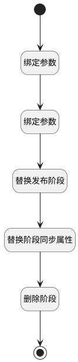

## 删除发布阶段 <!-- {docsify-ignore-all} -->

   删除发布阶段并替换

### 处理过程




### 处理步骤说明

#### 开始 :id=Begin<sup class="footnote-symbol"> <font color=gray size=1>[开始]</font></sup>


*- N/A*
#### 绑定参数 :id=BINDPARAM1<sup class="footnote-symbol"> <font color=gray size=1>[绑定参数]</font></sup>


绑定参数`Default(传入变量)` 到 `srfactionparam(选择对象列表)`
#### 绑定参数 :id=BINDPARAM2<sup class="footnote-symbol"> <font color=gray size=1>[绑定参数]</font></sup>


绑定参数`srfactionparam(选择对象列表)` 到 `replace(替换阶段)`
#### 替换发布阶段 :id=RAWSQLCALL1<sup class="footnote-symbol"> <font color=gray size=1>[直接SQL调用]</font></sup>


<p class="panel-title"><b>执行sql语句</b></p>

```sql
UPDATE project_release t1, stage t2 
SET t1.`STATUS` = t2.id 
WHERE t2.RELEASE_ID = t1.ID  
AND t2.pid = ? 
AND t1.`STATUS` = (SELECT id FROM stage WHERE release_id = t1.ID AND pid = ?)

```

<p class="panel-title"><b>执行sql参数</b></p>

1. `replace(替换阶段).replace_id`
2. `Default(传入变量).ID(标识)`


#### 替换阶段同步属性 :id=RAWSQLCALL2<sup class="footnote-symbol"> <font color=gray size=1>[直接SQL调用]</font></sup>


<p class="panel-title"><b>执行sql语句</b></p>

```sql
update stage t1, stage t2 
set t1.is_current = t2.is_current, t1.operated_time = t2.operated_time 
where t1.release_id = t2.release_id and t1.pid = ? and t2.pid = ?
```

<p class="panel-title"><b>执行sql参数</b></p>

1. `replace(替换阶段).replace_id`
2. `Default(传入变量).ID(标识)`


#### 删除阶段 :id=DEACTION1<sup class="footnote-symbol"> <font color=gray size=1>[实体行为]</font></sup>


调用实体 [发布阶段(STAGE)](module/ProjMgmt/stage.md) 行为 [Remove](module/ProjMgmt/stage#行为) ，行为参数为`Default(传入变量)`

#### 结束 :id=END1<sup class="footnote-symbol"> <font color=gray size=1>[结束]</font></sup>


返回 `replace(替换阶段)`


### 连接条件说明
#### 删除阶段标识不等于替换阶段标识 


### 实体逻辑参数

|    中文名   |    代码名    |  数据类型    |  实体   |备注 |
| --------| --------| -------- | -------- | --------   |
|传入变量(<i class="fa fa-check"/></i>)|Default|数据对象|[发布阶段(STAGE)](module/ProjMgmt/stage.md)||
|替换阶段|replace|数据对象|[发布阶段(STAGE)](module/ProjMgmt/stage.md)||
|选择对象列表|srfactionparam|数据对象列表|[发布阶段(STAGE)](module/ProjMgmt/stage.md)||
