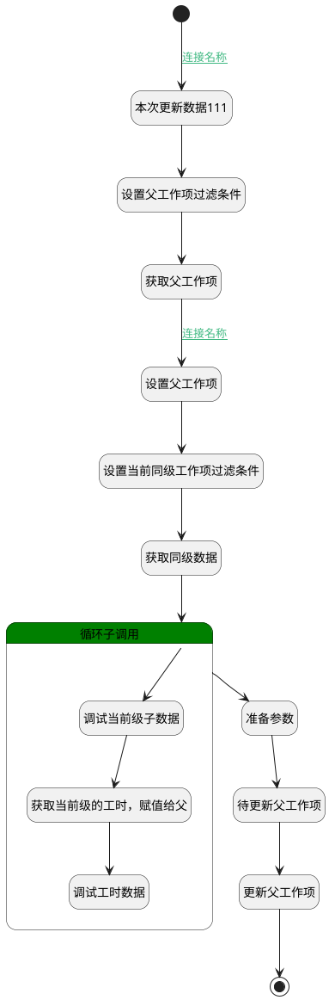

## 汇聚实际工时 <!-- {docsify-ignore-all} -->

   实际工时属性变更触发，未使用，暂时废弃

### 处理过程




### 处理步骤说明

#### 开始 :id=Begin<sup class="footnote-symbol"> <font color=gray size=1>[开始]</font></sup>


*- N/A*
#### 本次更新数据111 :id=DEBUGPARAM5<sup class="footnote-symbol"> <font color=gray size=1>[调试逻辑参数]</font></sup>


> [!NOTE|label:调试信息|icon:fa fa-bug]
> 调试输出参数`Default(传入变量)`的详细信息


#### 设置父工作项过滤条件 :id=PREPAREPARAM1<sup class="footnote-symbol"> <font color=gray size=1>[准备参数]</font></sup>


1. 将`Default(传入变量).PID(父标识)` 设置给  `p_work_item_filter(父工作项过滤器).N_ID_EQ`

#### 获取父工作项 :id=DEDATASET1<sup class="footnote-symbol"> <font color=gray size=1>[实体数据集]</font></sup>


调用实体 [工作项(WORK_ITEM)](module/ProjMgmt/work_item.md) 数据集合 [正常状态(normal)](module/ProjMgmt/work_item#数据集合) ，查询参数为`p_work_item_filter(父工作项过滤器)`

将执行结果返回给参数`p_work_item_page(父工作项分页)`

#### 设置父工作项 :id=PREPAREPARAM2<sup class="footnote-symbol"> <font color=gray size=1>[准备参数]</font></sup>


1. 将`p_work_item_page(父工作项分页).0` 绑定给  `p_work_item(父工作项)`

#### 设置当前同级工作项过滤条件 :id=PREPAREPARAM3<sup class="footnote-symbol"> <font color=gray size=1>[准备参数]</font></sup>


1. 将`p_work_item(父工作项).ID(标识)` 设置给  `cur_child_work_item_filter(当前级子工作项过滤器).N_PID_EQ`

#### 获取同级数据 :id=DEDATASET2<sup class="footnote-symbol"> <font color=gray size=1>[实体数据集]</font></sup>


调用实体 [工作项(WORK_ITEM)](module/ProjMgmt/work_item.md) 数据集合 [正常状态(normal)](module/ProjMgmt/work_item#数据集合) ，查询参数为`cur_child_work_item_filter(当前级子工作项过滤器)`

将执行结果返回给参数`cur_child_work_item_page(当前级子工作项)`

#### 循环子调用 :id=LOOPSUBCALL1<sup class="footnote-symbol"> <font color=gray size=1>[循环子调用]</font></sup>


循环参数`cur_child_work_item_page(当前级子工作项)`，子循环参数使用`cur_work_item_temp(当前级工作项临时对象)`
#### 待更新父工作项 :id=DEBUGPARAM3<sup class="footnote-symbol"> <font color=gray size=1>[调试逻辑参数]</font></sup>


> [!NOTE|label:调试信息|icon:fa fa-bug]
> 调试输出参数`p_work_item(父工作项)`的详细信息


#### 更新父工作项 :id=DEACTION1<sup class="footnote-symbol"> <font color=gray size=1>[实体行为]</font></sup>


调用实体 [工作项(WORK_ITEM)](module/ProjMgmt/work_item.md) 行为 [Update](module/ProjMgmt/work_item#行为) ，行为参数为`p_work_item(父工作项)`

#### 调试当前级子数据 :id=DEBUGPARAM4<sup class="footnote-symbol"> <font color=gray size=1>[调试逻辑参数]</font></sup>


> [!NOTE|label:调试信息|icon:fa fa-bug]
> 调试输出参数`cur_work_item_temp(当前级工作项临时对象)`的详细信息


#### 准备参数 :id=PREPAREPARAM4<sup class="footnote-symbol"> <font color=gray size=1>[准备参数]</font></sup>


1. 将`workload_data(工时数据).actual_workload(实际工时)` 设置给  `p_work_item(父工作项).ACTUAL_WORKLOAD(实际工时)`
2. 将`workload_data(工时数据).estimated_workload(预估工时)` 设置给  `p_work_item(父工作项).ESTIMATED_WORKLOAD(预估工时)`

#### 获取当前级的工时，赋值给父 :id=RAWSFCODE1<sup class="footnote-symbol"> <font color=gray size=1>[直接后台代码]</font></sup>


<p class="panel-title"><b>执行代码[JavaScript]</b></p>

```javascript
var work_item_temp = logic.getParam("cur_work_item_temp");
var p_work_item = logic.getParam("p_work_item");
var workload_data = logic.getParam("workload_data");
var cur_estimated_workload = parseFloat(work_item_temp && work_item_temp.get("estimated_workload")) || 0;
var cur_actual_workload = parseFloat(work_item_temp && work_item_temp.get("actual_workload")) || 0;

workload_data.set("estimated_workload", cur_estimated_workload + workload_data.get("estimated_workload"));
sys.info("当前工作项实际工时"+cur_actual_workload);
workload_data.set("actual_workload",cur_actual_workload + workload_data.get("actual_workload")) ;

```

#### 结束 :id=END1<sup class="footnote-symbol"> <font color=gray size=1>[结束]</font></sup>


*- N/A*

#### 调试工时数据 :id=DEBUGPARAM2<sup class="footnote-symbol"> <font color=gray size=1>[调试逻辑参数]</font></sup>


> [!NOTE|label:调试信息|icon:fa fa-bug]
> 调试输出参数`workload_data(工时数据)`的详细信息


### 连接条件说明
#### 连接名称 :id=Begin-DEBUGPARAM5

`Default(传入变量).PID(父标识)` ISNOTNULL
#### 连接名称 :id=DEDATASET1-PREPAREPARAM2

`p_work_item_page(父工作项分页).size` GT `0`


### 实体逻辑参数

|    中文名   |    代码名    |  数据类型    |  实体   |备注 |
| --------| --------| -------- | -------- | --------   |
|传入变量(<i class="fa fa-check"/></i>)|Default|数据对象|[工作项(WORK_ITEM)](module/ProjMgmt/work_item.md)||
|实际工时|actual_workload|简单数据|||
|当前级子工作项过滤器|cur_child_work_item_filter|过滤器|||
|当前级子工作项|cur_child_work_item_page|分页查询|||
|当前级工作项临时对象|cur_work_item_temp|数据对象|[工作项(WORK_ITEM)](module/ProjMgmt/work_item.md)||
|预估工时|estimated_workload|简单数据|||
|父工作项|p_work_item|数据对象|[工作项(WORK_ITEM)](module/ProjMgmt/work_item.md)||
|父工作项过滤器|p_work_item_filter|过滤器|||
|父工作项分页|p_work_item_page|分页查询|||
|工时数据|workload_data|数据对象|[工作项(WORK_ITEM)](module/ProjMgmt/work_item.md)||
