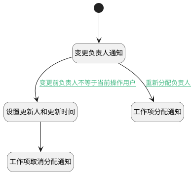

## 工作项负责人变更附加逻辑 <!-- {docsify-ignore-all} -->

   工作项负责人变更时触发相应的通知消息

### 处理过程

### 处理步骤说明

#### 开始 :id=Begin [开始]

*- N/A*
#### 变更负责人通知 :id=DENOTIFY3 [实体通知]

调用实体 [工作项(WORK_ITEM)](module/ProjMgmt/work_item.md) 通知 [工作项负责人变更通知(assignee_onchange_notify)](module/ProjMgmt/work_item/notify/assignee_onchange_notify) ，参数为`Default(传入变量)`
#### 设置更新人和更新时间 :id=PREPAREPARAM1 [准备参数]

1. 将`Default(传入变量).UPDATE_MAN(更新人)` 设置给  `Last(变更前).UPDATE_MAN`
2. 将`Default(传入变量).UPDATE_TIME(更新时间)` 设置给  `Last(变更前).UPDATE_TIME`

#### 工作项取消分配通知 :id=DENOTIFY2 [实体通知]

调用实体 [工作项(WORK_ITEM)](module/ProjMgmt/work_item.md) 通知 [工作项取消负责人通知(cancel_assignee_notify)](module/ProjMgmt/work_item/notify/cancel_assignee_notify) ，参数为`Last(变更前)`
#### 工作项分配通知 :id=DENOTIFY1 [实体通知]

调用实体 [工作项(WORK_ITEM)](module/ProjMgmt/work_item.md) 通知 [工作项分配负责人通知(allocation_notify)](module/ProjMgmt/work_item/notify/allocation_notify) ，参数为`Default(传入变量)`

### 连接条件说明
#### 重新分配负责人 :id=DENOTIFY3-DENOTIFY1

`Default(传入变量).ASSIGNEE_ID(负责人)` ISNOTNULL AND 
#### 变更前负责人不等于当前操作用户 :id=DENOTIFY3-PREPAREPARAM1

`Last(变更前).ASSIGNEE_ID` ISNOTNULL AND 

### 实体逻辑参数

|    中文名   |    代码名    |  数据类型    |  实体   |备注 |
| --------| --------| -------- | -------- | --------   |
|传入变量(<i class="fa fa-check"/></i>)|Default|数据对象|[工作项(WORK_ITEM)](module/ProjMgmt/work_item.md)||
|变更前|Last|最后数据变量|||
