## 需求累计流图 <!-- {docsify-ignore-all} -->

   报表需求累计流图数据源

### 处理过程

```plantuml
@startuml
hide empty description
<style>
root {
  HyperlinkColor #42b983
}
</style>

hide empty description
state "开始" as Begin <<start>> [[$./backlog_accumulate_flow#begin {"开始"}]]
state "结束" as END1 <<end>> [[$./backlog_accumulate_flow#end1 {"结束"}]]
state "直接SQL调用" as RAWSQLCALL1  [[$./backlog_accumulate_flow#rawsqlcall1 {"直接SQL调用"}]]


Begin --> RAWSQLCALL1
RAWSQLCALL1 --> END1


@enduml
```




### 处理步骤说明

#### 开始 :id=Begin<sup class="footnote-symbol"> <font color=gray size=1>[开始]</font></sup>


*- N/A*
#### 结束 :id=END1<sup class="footnote-symbol"> <font color=gray size=1>[结束]</font></sup>


返回 `result`

#### 直接SQL调用 :id=RAWSQLCALL1<sup class="footnote-symbol"> <font color=gray size=1>[直接SQL调用]</font></sup>


<p class="panel-title"><b>执行sql语句</b></p>

```sql
SELECT
    date_series.date AS filter_type,
    SUM(CASE WHEN wi.STATE_TYPE = 'pending' THEN 1 ELSE 0 END) AS count,
    SUM(CASE WHEN wi.STATE_TYPE = 'in_progress' THEN 1 ELSE 0 END) AS count1,
    SUM(CASE WHEN wi.STATE_TYPE = 'completed' THEN 1 ELSE 0 END) AS count2
FROM (
    SELECT DATE_ADD(?, INTERVAL seq.seq DAY) AS date
    FROM (
        SELECT a.i + b.i * 10 + c.i * 100 AS seq
        FROM
        (SELECT 0 AS i UNION SELECT 1 UNION SELECT 2 UNION SELECT 3 UNION SELECT 4 UNION SELECT 5 UNION SELECT 6 UNION SELECT 7 UNION SELECT 8 UNION SELECT 9) a,
        (SELECT 0 AS i UNION SELECT 1 UNION SELECT 2 UNION SELECT 3 UNION SELECT 4 UNION SELECT 5 UNION SELECT 6 UNION SELECT 7 UNION SELECT 8 UNION SELECT 9) b,
        (SELECT 0 AS i UNION SELECT 1 UNION SELECT 2 UNION SELECT 3 UNION SELECT 4 UNION SELECT 5 UNION SELECT 6 UNION SELECT 7 UNION SELECT 8 UNION SELECT 9) c
    ) seq
    WHERE DATE_ADD(?, INTERVAL seq.seq DAY) BETWEEN ? AND ?
) date_series
LEFT JOIN (
    SELECT
        t1.`CREATE_TIME`,
        t31.`TYPE` AS `STATE_TYPE`
    FROM `WORK_ITEM` t1
    LEFT JOIN `WORK_ITEM_TYPE` t21 ON t1.`WORK_ITEM_TYPE_ID` = t21.`ID`
    LEFT JOIN `WORK_ITEM_STATE` t31 ON t1.`STATE` = t31.`ID`
    WHERE
        t21.`GROUP` = 'requirement'
        AND t1.`IS_DELETED` = 0
        AND t1.`PROJECT_ID` = ?
        AND t1.`CREATE_TIME` <= ?
        AND ((? IS NULL OR ? = '') OR FIND_IN_SET(t1.WORK_ITEM_TYPE_ID, ?))
        AND ((? IS NULL OR ? = '') OR FIND_IN_SET(t1.IS_ARCHIVED, ?))
) wi ON wi.CREATE_TIME <= date_series.date
GROUP BY
    date_series.date
ORDER BY
    date_series.date ASC;

```

<p class="panel-title"><b>执行sql参数</b></p>

1. `Default(传入变量).n_create_time_gtandeq`
2. `Default(传入变量).n_create_time_gtandeq`
3. `Default(传入变量).n_create_time_gtandeq`
4. `Default(传入变量).n_create_time_ltandeq`
5. `Default(传入变量).N_PROJECT_ID_EQ`
6. `Default(传入变量).N_PROJECT_ID_EQ`
7. `Default(传入变量).N_WORK_ITEM_TYPE_ID_EQ`
8. `Default(传入变量).N_WORK_ITEM_TYPE_ID_EQ`
9. `Default(传入变量).N_WORK_ITEM_TYPE_ID_EQ`
10. `Default(传入变量).n_is_archived_in`
11. `Default(传入变量).n_is_archived_in`
12. `Default(传入变量).n_is_archived_in`

重置参数`result(result)`，并将执行sql结果赋值给参数`result(result)`


### 实体逻辑参数

|    中文名   |    代码名    |  数据类型    |  实体   |备注 |
| --------| --------| -------- | -------- | --------   |
|传入变量(<i class="fa fa-check"/></i>)|Default|过滤器|||
|result|result|数据对象列表|||
