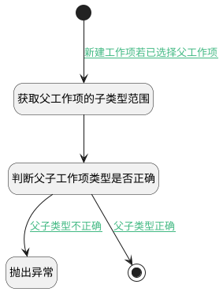

## 新建工作项前校验父子工作项类型 <!-- {docsify-ignore-all} -->

   新建工作项前校验父子工作项类型

### 处理过程




### 处理步骤说明

#### 开始 :id=Begin<sup class="footnote-symbol"> <font color=gray size=1>[开始]</font></sup>


*- N/A*
#### 获取父工作项的子类型范围 :id=RAWSQLCALL1<sup class="footnote-symbol"> <font color=gray size=1>[直接SQL调用]</font></sup>


<p class="panel-title"><b>执行sql语句</b></p>

```sql
select sub_type as work_item_sub_type from work_item_type t1
where exists(select 1 from work_item t2 where t1.id = t2.work_item_type_id and t2.id = ?)
```

<p class="panel-title"><b>执行sql参数</b></p>

1. `Default(传入变量).PID(父标识)`

将执行sql结果赋值给参数`parent_work_item(父工作项)`

#### 判断父子工作项类型是否正确 :id=RAWSFCODE1<sup class="footnote-symbol"> <font color=gray size=1>[直接后台代码]</font></sup>


<p class="panel-title"><b>执行代码[Groovy]</b></p>

```groovy
// 父工作项的下级工作项范围
def parent_work_item = logic.param('parent_work_item').getReal()
def work_item_sub_type = parent_work_item.get('work_item_sub_type')
// 新建工作项的类型
def _default = logic.param('default').getReal()
_default.set('check_type', 0)
def child_type = _default.get('work_item_type_id')
if(work_item_sub_type != null && child_type != null){
    if(work_item_sub_type.contains(child_type)){
        _default.set('check_type', 1)
    }
}

```

#### 抛出异常 :id=THROWEXCEPTION1<sup class="footnote-symbol"> <font color=gray size=1>[抛出异常]</font></sup>


> [!ATTENTION|label:抛出异常|icon:fa fa-warning]
> 错误信息：父工作项类型不正确

#### 结束 :id=END1<sup class="footnote-symbol"> <font color=gray size=1>[结束]</font></sup>


*- N/A*


### 连接条件说明
#### 新建工作项若已选择父工作项 :id=Begin-RAWSQLCALL1

`Default(传入变量).PID(父标识)` ISNOTNULL
#### 父子类型正确 :id=RAWSFCODE1-END1

`Default(传入变量).check_type` EQ `1`
#### 父子类型不正确 :id=RAWSFCODE1-THROWEXCEPTION1

`Default(传入变量).check_type` EQ `0`


### 实体逻辑参数

|    中文名   |    代码名    |  数据类型    |  实体   |备注 |
| --------| --------| -------- | -------- | --------   |
|传入变量(<i class="fa fa-check"/></i>)|Default|数据对象|[工作项(WORK_ITEM)](module/ProjMgmt/work_item.md)||
|父工作项|parent_work_item|数据对象|[工作项(WORK_ITEM)](module/ProjMgmt/work_item.md)||
