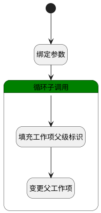

## 变更父工作项 <!-- {docsify-ignore-all} -->

   变更父工作项

### 处理过程

### 处理步骤说明

#### 开始 :id=Begin [开始]

*- N/A*
#### 绑定参数 :id=BINDPARAM1 [绑定参数]

绑定参数`Default(传入变量)` 到 `srfactionparam(选中数据列表)`
#### 循环子调用 :id=LOOPSUBCALL1 [循环子调用]

循环参数`srfactionparam(选中数据列表)`，子循环参数使用`for_temp_obj(循环临时变量)`
#### 填充工作项父级标识 :id=PREPAREPARAM1 [准备参数]

1. 将`for_temp_obj(循环临时变量).ID(标识)` 设置给  `Default(传入变量).PID(父标识)`

#### 变更父工作项 :id=DEACTION1 [实体行为]

调用实体 [工作项(WORK_ITEM)](module/ProjMgmt/work_item.md) 行为 [Update](module/ProjMgmt/work_item#行为) ，行为参数为`Default(传入变量)`

### 实体逻辑参数

|    中文名   |    代码名    |  数据类型    |  实体   |备注 |
| --------| --------| -------- | -------- | --------   |
|传入变量(<i class="fa fa-check"/></i>)|Default|数据对象|[工作项(WORK_ITEM)](module/ProjMgmt/work_item.md)||
|循环临时变量|for_temp_obj|数据对象|[工作项(WORK_ITEM)](module/ProjMgmt/work_item.md)||
|父工作项|parent_obj|数据对象|[工作项(WORK_ITEM)](module/ProjMgmt/work_item.md)||
|选中数据列表|srfactionparam|数据对象列表|[工作项(WORK_ITEM)](module/ProjMgmt/work_item.md)||
