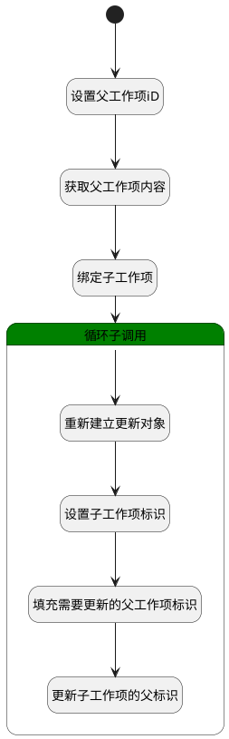

## 选择子工作项 <!-- {docsify-ignore-all} -->

   选择子工作项

### 处理过程




### 处理步骤说明

#### 开始 :id=Begin<sup class="footnote-symbol"> <font color=gray size=1>[开始]</font></sup>


*- N/A*
#### 设置父工作项iD :id=PREPAREPARAM2<sup class="footnote-symbol"> <font color=gray size=1>[准备参数]</font></sup>


1. 将`Default(传入变量).PID(父标识)` 设置给  `parent_work_item(父工作项).ID(标识)`

#### 获取父工作项内容 :id=DEACTION2<sup class="footnote-symbol"> <font color=gray size=1>[实体行为]</font></sup>


调用实体 [工作项(WORK_ITEM)](module/ProjMgmt/work_item.md) 行为 [Get](module/ProjMgmt/work_item#行为) ，行为参数为`parent_work_item(父工作项)`

将执行结果返回给参数`parent_work_item(父工作项)`

#### 绑定子工作项 :id=BINDPARAM1<sup class="footnote-symbol"> <font color=gray size=1>[绑定参数]</font></sup>


绑定参数`Default(传入变量)` 到 `srfactionparam(选中子工作项列表)`
#### 循环子调用 :id=LOOPSUBCALL1<sup class="footnote-symbol"> <font color=gray size=1>[循环子调用]</font></sup>


循环参数`srfactionparam(选中子工作项列表)`，子循环参数使用`for_temp_obj(循环临时变量)`
#### 重新建立更新对象 :id=RENEWPARAM1<sup class="footnote-symbol"> <font color=gray size=1>[重新建立参数]</font></sup>


重建参数```update_obj(更新对象)```
#### 设置子工作项标识 :id=RAWSFCODE1<sup class="footnote-symbol"> <font color=gray size=1>[直接后台代码]</font></sup>


<p class="panel-title"><b>执行代码[Groovy]</b></p>

```groovy
def for_temp_obj = logic.param('for_temp_obj').getReal()

def update_obj = logic.param('update_obj').getReal()


// PC端 使用owner_id   mob端 使用id 
if(for_temp_obj.get('id') != null){
    update_obj.set('id', for_temp_obj.get('id'))
}
if(for_temp_obj.get('owner_id') != null){
    update_obj.set('id', for_temp_obj.get('owner_id'))
}


```

#### 填充需要更新的父工作项标识 :id=PREPAREPARAM1<sup class="footnote-symbol"> <font color=gray size=1>[准备参数]</font></sup>


1. 将`parent_work_item(父工作项).ID(标识)` 设置给  `update_obj(更新对象).PID(父标识)`

#### 更新子工作项的父标识 :id=DEACTION3<sup class="footnote-symbol"> <font color=gray size=1>[实体行为]</font></sup>


调用实体 [工作项(WORK_ITEM)](module/ProjMgmt/work_item.md) 行为 [Update](module/ProjMgmt/work_item#行为) ，行为参数为`update_obj(更新对象)`


### 实体逻辑参数

|    中文名   |    代码名    |  数据类型    |  实体   |备注 |
| --------| --------| -------- | -------- | --------   |
|传入变量(<i class="fa fa-check"/></i>)|Default|数据对象|[工作项(WORK_ITEM)](module/ProjMgmt/work_item.md)||
|循环临时变量|for_temp_obj|数据对象|[工作项(WORK_ITEM)](module/ProjMgmt/work_item.md)||
|父工作项|parent_work_item|数据对象|[工作项(WORK_ITEM)](module/ProjMgmt/work_item.md)||
|选中子工作项列表|srfactionparam|数据对象列表|[工作项(WORK_ITEM)](module/ProjMgmt/work_item.md)||
|更新对象|update_obj|数据对象|[工作项(WORK_ITEM)](module/ProjMgmt/work_item.md)||
