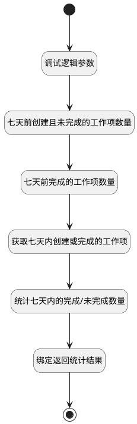

## 工作项完成趋势 <!-- {docsify-ignore-all} -->

   工作项完成趋势

### 处理过程




### 处理步骤说明

#### 开始 :id=Begin<sup class="footnote-symbol"> <font color=gray size=1>[开始]</font></sup>


*- N/A*
#### 调试逻辑参数 :id=DEBUGPARAM1<sup class="footnote-symbol"> <font color=gray size=1>[调试逻辑参数]</font></sup>


> [!NOTE|label:调试信息|icon:fa fa-bug]
> 调试输出参数`Default(传入变量)`的详细信息


#### 七天前创建且未完成的工作项数量 :id=RAWSQLCALL1<sup class="footnote-symbol"> <font color=gray size=1>[直接SQL调用]</font></sup>


<p class="panel-title"><b>执行sql语句</b></p>

```sql
select count(1) as `seven_ago_not_completed`  from work_item t1, work_item_state t2 
where t1.`STATE` = t2.ID and t2.`TYPE`  <> 'completed'
and datediff(curdate(), t1.CREATE_TIME) >= 7  
and t1.PROJECT_ID = ? and t1.IS_DELETED = 0
```

<p class="panel-title"><b>执行sql参数</b></p>

1. `Default(传入变量).n_project_id_eq`

重置参数`work_item(工作项对象)`，并将执行sql结果赋值给参数`work_item(工作项对象)`

#### 七天前完成的工作项数量 :id=RAWSQLCALL2<sup class="footnote-symbol"> <font color=gray size=1>[直接SQL调用]</font></sup>


<p class="panel-title"><b>执行sql语句</b></p>

```sql
select count(1) as `seven_ago_completed` from work_item t1, work_item_state t2 
where t1.STATE = t2.id and t2.`TYPE` = 'completed'
and datediff(curdate(), t1.COMPLETED_AT) >= 7  
and t1.PROJECT_ID = ? 
and t1.IS_DELETED = 0
```

<p class="panel-title"><b>执行sql参数</b></p>

1. `Default(传入变量).n_project_id_eq`

重置参数`work_item(工作项对象)`，并将执行sql结果赋值给参数`work_item(工作项对象)`

#### 获取七天内创建或完成的工作项 :id=DEDATASET1<sup class="footnote-symbol"> <font color=gray size=1>[实体数据集]</font></sup>


调用实体 [工作项(WORK_ITEM)](module/ProjMgmt/work_item.md) 数据集合 [七天内创建或完成的工作项(seven_days)](module/ProjMgmt/work_item#数据集合) ，查询参数为`Default(传入变量)`

将执行结果返回给参数`result_page(返回分页结果对象)`

#### 统计七天内的完成/未完成数量 :id=RAWSFCODE1<sup class="footnote-symbol"> <font color=gray size=1>[直接后台代码]</font></sup>


<p class="panel-title"><b>执行代码[Groovy]</b></p>

```groovy
def result_list = logic.param('result_list').getReal()
def result_page = logic.param('result_page').getReal()
def work_item = logic.param('work_item').getReal()

// 七天前未完成数量
def not_completed = work_item.get('seven_ago_not_completed')
def completed = work_item.get('seven_ago_completed')

def dateFormatter = new java.text.SimpleDateFormat("yyyy-MM-dd")
def calendar = java.util.Calendar.getInstance()

// 获取当前日期
def endDate = calendar.time

// 获取6天前的日期
calendar.add(Calendar.DAY_OF_MONTH, -6)
def startDate = calendar.time

// 生成日期列表
def datesInRange = []
calendar.time = startDate // 重置日历到起始日期

while (calendar.time <= endDate) {
    def rep_date = dateFormatter.format(calendar.time)
    def rep_obj = sys.entity('work_item')
    rep_obj.set('rep_date', rep_date) 
    result_list.add(rep_obj)
    calendar.add(java.util.Calendar.DATE, 1)
}
result_list.each { it ->
    def rep_date = dateFormatter.format(new Date(it.get('rep_date').time))
    result_page.each { item ->
        def state_type = item.get('state_type')
        if(state_type != null){
            if(state_type == 'completed' && item.get('completed_at') != null){
                def completed_at = dateFormatter.format(new Date(item.get('completed_at').time))
                if(completed_at == rep_date){
                    completed++
                    not_completed--
                }   
            } else if(state_type != 'completed' && item.get('create_time') != null){
                def create_time = dateFormatter.format(new Date(item.get('create_time').time))
                if(create_time == rep_date){
                    not_completed++
                }
            }
        }
    }
    it.set('rep_value1', not_completed)
    it.set('rep_value2', completed)
}


```

#### 绑定返回统计结果 :id=BINDPARAM1<sup class="footnote-symbol"> <font color=gray size=1>[绑定参数]</font></sup>


绑定参数`result_list(返回结果集合)` 到 `result_page(返回分页结果对象)`
#### 绑定返回结果 :id=END1<sup class="footnote-symbol"> <font color=gray size=1>[结束]</font></sup>


返回 `result_page(返回分页结果对象)`


### 实体逻辑参数

|    中文名   |    代码名    |  数据类型    |  实体   |备注 |
| --------| --------| -------- | -------- | --------   |
|传入变量(<i class="fa fa-check"/></i>)|Default|过滤器|||
|返回结果集合|result_list|数据对象列表|[工作项(WORK_ITEM)](module/ProjMgmt/work_item.md)||
|返回分页结果对象|result_page|分页查询|||
|工作项对象|work_item|数据对象|[工作项(WORK_ITEM)](module/ProjMgmt/work_item.md)||
