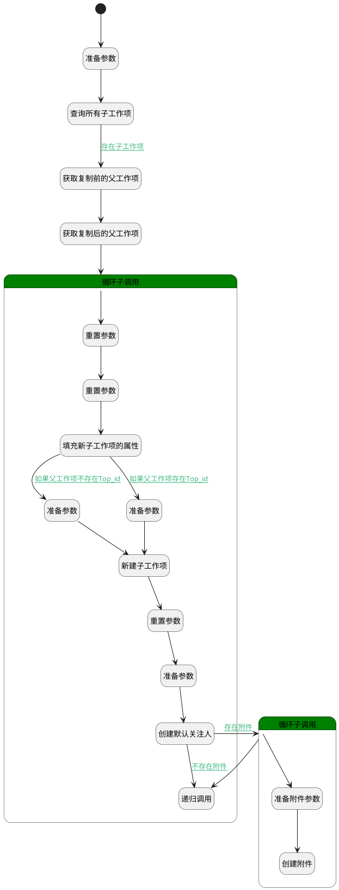

## 复制子工作项 <!-- {docsify-ignore-all} -->

   复制工作项时，同时复制子工作项

### 处理过程




### 处理步骤说明

#### 开始 :id=Begin<sup class="footnote-symbol"> <font color=gray size=1>[开始]</font></sup>


*- N/A*
#### 准备参数 :id=PREPAREPARAM1<sup class="footnote-symbol"> <font color=gray size=1>[准备参数]</font></sup>


1. 将`Default(传入变量).old_parent_id` 设置给  `before_copy_parent(复制前的父工作项).ID(标识)`
2. 将`Default(传入变量).old_parent_id` 设置给  `query_child_filter(查询子项过滤器).n_pid_eq`
3. 将`Default(传入变量).new_parent_id` 设置给  `after_copy_parent(复制后的父工作项).ID(标识)`

#### 查询所有子工作项 :id=DEDATASET1<sup class="footnote-symbol"> <font color=gray size=1>[实体数据集]</font></sup>


调用实体 [工作项(WORK_ITEM)](module/ProjMgmt/work_item.md) 数据集合 [正常状态(normal)](module/ProjMgmt/work_item#数据集合) ，查询参数为`query_child_filter(查询子项过滤器)`

将执行结果返回给参数`child_page(子工作项分页结果变量)`

#### 获取复制前的父工作项 :id=DEACTION1<sup class="footnote-symbol"> <font color=gray size=1>[实体行为]</font></sup>


调用实体 [工作项(WORK_ITEM)](module/ProjMgmt/work_item.md) 行为 [Get](module/ProjMgmt/work_item#行为) ，行为参数为`before_copy_parent(复制前的父工作项)`

将执行结果返回给参数`before_copy_parent(复制前的父工作项)`

#### 获取复制后的父工作项 :id=DEACTION2<sup class="footnote-symbol"> <font color=gray size=1>[实体行为]</font></sup>


调用实体 [工作项(WORK_ITEM)](module/ProjMgmt/work_item.md) 行为 [Get](module/ProjMgmt/work_item#行为) ，行为参数为`after_copy_parent(复制后的父工作项)`

将执行结果返回给参数`after_copy_parent(复制后的父工作项)`

#### 循环子调用 :id=LOOPSUBCALL1<sup class="footnote-symbol"> <font color=gray size=1>[循环子调用]</font></sup>


循环参数`child_page(子工作项分页结果变量)`，子循环参数使用`for_temp_obj(循环临时变量)`
#### 重置参数 :id=RESETPARAM1<sup class="footnote-symbol"> <font color=gray size=1>[重置参数]</font></sup>


重置参数```new_child(新建子工作项)```
#### 重置参数 :id=RESETPARAM2<sup class="footnote-symbol"> <font color=gray size=1>[重置参数]</font></sup>


重置参数```attachments(附件列表)```
#### 准备参数 :id=PREPAREPARAM3<sup class="footnote-symbol"> <font color=gray size=1>[准备参数]</font></sup>


1. 将`after_copy_parent(复制后的父工作项).ID(标识)` 设置给  `new_child(新建子工作项).TOP_ID(顶级工作项标识)`

#### 填充新子工作项的属性 :id=PREPAREPARAM2<sup class="footnote-symbol"> <font color=gray size=1>[准备参数]</font></sup>


1. 将`after_copy_parent(复制后的父工作项).PROJECT_ID(项目)` 设置给  `new_child(新建子工作项).PROJECT_ID(项目)`
2. 将`for_temp_obj(循环临时变量).DESCRIPTION(描述)` 设置给  `new_child(新建子工作项).DESCRIPTION(描述)`
3. 将`for_temp_obj(循环临时变量).ATTACHMENTS(附件)` 绑定给  `attachments(附件列表)`
4. 将`for_temp_obj(循环临时变量).WORK_ITEM_TYPE_ID(工作项类型)` 设置给  `new_child(新建子工作项).WORK_ITEM_TYPE_ID(工作项类型)`
5. 将`for_temp_obj(循环临时变量).TITLE(标题)` 设置给  `new_child(新建子工作项).TITLE(标题)`
6. 将`for_temp_obj(循环临时变量).PRIORITY(优先级)` 设置给  `new_child(新建子工作项).PRIORITY(优先级)`
7. 将`for_temp_obj(循环临时变量).START_AT(开始时间)` 设置给  `new_child(新建子工作项).START_AT(开始时间)`
8. 将`for_temp_obj(循环临时变量).END_AT(结束时间)` 设置给  `new_child(新建子工作项).END_AT(结束时间)`
9. 将`for_temp_obj(循环临时变量).STATE(状态)` 设置给  `new_child(新建子工作项).STATE(状态)`
10. 将`after_copy_parent(复制后的父工作项).ID(标识)` 设置给  `new_child(新建子工作项).PID(父标识)`

#### 新建子工作项 :id=DEACTION3<sup class="footnote-symbol"> <font color=gray size=1>[实体行为]</font></sup>


调用实体 [工作项(WORK_ITEM)](module/ProjMgmt/work_item.md) 行为 [Create](module/ProjMgmt/work_item#行为) ，行为参数为`new_child(新建子工作项)`

将执行结果返回给参数`new_child(新建子工作项)`

#### 准备参数 :id=PREPAREPARAM4<sup class="footnote-symbol"> <font color=gray size=1>[准备参数]</font></sup>


1. 将`after_copy_parent(复制后的父工作项).TOP_ID(顶级工作项标识)` 设置给  `new_child(新建子工作项).TOP_ID(顶级工作项标识)`

#### 重置参数 :id=RESETPARAM3<sup class="footnote-symbol"> <font color=gray size=1>[重置参数]</font></sup>


重置参数```attention(关注)```
#### 准备参数 :id=PREPAREPARAM6<sup class="footnote-symbol"> <font color=gray size=1>[准备参数]</font></sup>


1. 将`for_temp_obj(循环临时变量).ID(标识)` 设置给  `recursion(递归传入对象).old_parent_id`
2. 将`用户全局对象.srfpersonname` 设置给  `attention(关注).NAME(名称)`
3. 将`new_child(新建子工作项).CREATE_MAN(建立人)` 设置给  `attention(关注).USER_ID(关注人)`
4. 将`WORK_ITEM` 设置给  `attention(关注).OWNER_SUBTYPE(所属对象子类型)`
5. 将`WORK_ITEM` 设置给  `attention(关注).OWNER_TYPE(所属数据对象)`
6. 将`40` 设置给  `attention(关注).TYPE(关注类型)`
7. 将`new_child(新建子工作项).ID(标识)` 设置给  `attention(关注).OWNER_ID(所属数据标识)`
8. 将`new_child(新建子工作项).ID(标识)` 设置给  `recursion(递归传入对象).new_parent_id`

#### 创建默认关注人 :id=DEACTION5<sup class="footnote-symbol"> <font color=gray size=1>[实体行为]</font></sup>


调用实体 [关注(ATTENTION)](module/Base/attention.md) 行为 [Save](module/Base/attention#行为) ，行为参数为`attention(关注)`

#### 循环子调用 :id=LOOPSUBCALL2<sup class="footnote-symbol"> <font color=gray size=1>[循环子调用]</font></sup>


循环参数`attachments(附件列表)`，子循环参数使用`attachment(附件)`
#### 准备附件参数 :id=PREPAREPARAM5<sup class="footnote-symbol"> <font color=gray size=1>[准备参数]</font></sup>


1. 将`空值（NULL）` 设置给  `attachment(附件).ID(标识)`
2. 将`new_child(新建子工作项).ID(标识)` 设置给  `attachment(附件).OWNER_ID(所属数据标识)`
3. 将`WORK_ITEM` 设置给  `attachment(附件).OWNER_TYPE(所属数据对象)`

#### 创建附件 :id=DEACTION4<sup class="footnote-symbol"> <font color=gray size=1>[实体行为]</font></sup>


调用实体 [附件(ATTACHMENT)](module/Base/attachment.md) 行为 [Create](module/Base/attachment#行为) ，行为参数为`attachment(附件)`

#### 递归调用 :id=DELOGIC1<sup class="footnote-symbol"> <font color=gray size=1>[实体逻辑]</font></sup>


调用实体 [工作项(WORK_ITEM)](module/ProjMgmt/work_item.md) 处理逻辑 [复制子工作项]((module/ProjMgmt/work_item/logic/copy_child_work_item.md)) ，行为参数为`recursion(递归传入对象)`


### 连接条件说明
#### 存在子工作项 :id=DEDATASET1-DEACTION1

`child_page(子工作项分页结果变量).size` GT `0`
#### 如果父工作项不存在Top_id :id=PREPAREPARAM2-PREPAREPARAM3

`after_copy_parent(复制后的父工作项).TOP_ID(顶级工作项标识)` ISNULL
#### 存在附件 :id=DEACTION5-LOOPSUBCALL2

`attachments(附件列表)` ISNOTNULL
#### 不存在附件 :id=DEACTION5-DELOGIC1

`for_temp_obj(循环临时变量).ATTACHMENTS(附件)` ISNULL
#### 如果父工作项存在Top_id :id=PREPAREPARAM2-PREPAREPARAM4

`after_copy_parent(复制后的父工作项).TOP_ID(顶级工作项标识)` ISNOTNULL


### 实体逻辑参数

|    中文名   |    代码名    |  数据类型    |  实体   |备注 |
| --------| --------| -------- | -------- | --------   |
|传入变量(<i class="fa fa-check"/></i>)|Default|数据对象|[工作项(WORK_ITEM)](module/ProjMgmt/work_item.md)||
|复制后的父工作项|after_copy_parent|数据对象|[工作项(WORK_ITEM)](module/ProjMgmt/work_item.md)||
|附件|attachment|数据对象|[附件(ATTACHMENT)](module/Base/attachment.md)||
|附件列表|attachments|数据对象列表|[附件(ATTACHMENT)](module/Base/attachment.md)||
|关注|attention|数据对象|[关注(ATTENTION)](module/Base/attention.md)||
|复制前的父工作项|before_copy_parent|数据对象|[工作项(WORK_ITEM)](module/ProjMgmt/work_item.md)||
|子工作项分页结果变量|child_page|分页查询|||
|循环临时变量|for_temp_obj|数据对象|[工作项(WORK_ITEM)](module/ProjMgmt/work_item.md)||
|新建子工作项|new_child|数据对象|[工作项(WORK_ITEM)](module/ProjMgmt/work_item.md)||
|查询子项过滤器|query_child_filter|过滤器|||
|递归传入对象|recursion|数据对象|[工作项(WORK_ITEM)](module/ProjMgmt/work_item.md)||
