## 复制工作项 <!-- {docsify-ignore-all} -->

   复制工作项到其他的同类型项目

### 处理过程

```plantuml
@startuml
hide empty description
<style>
root {
  HyperlinkColor #42b983
}
</style>

hide empty description
state "开始" as Begin <<start>> [[$./copy_work_item#begin {"开始"}]]
state "绑定参数" as BINDPARAM1  [[$./copy_work_item#bindparam1 {"绑定参数"}]]
state "准备参数" as PREPAREPARAM5  [[$./copy_work_item#prepareparam5 {"准备参数"}]]
state "结束" as END1 <<end>> [[$./copy_work_item#end1 {"结束"}]]
state "循环子调用" as LOOPSUBCALL1  [[$./copy_work_item#loopsubcall1 {"循环子调用"}]] #green {
state "获取工作项" as DEACTION4  [[$./copy_work_item#deaction4 {"获取工作项"}]]
state "同步属性" as PREPAREPARAM2  [[$./copy_work_item#prepareparam2 {"同步属性"}]]
state "创建工作项" as DEACTION1  [[$./copy_work_item#deaction1 {"创建工作项"}]]
state "关联数据属性" as PREPAREPARAM8  [[$./copy_work_item#prepareparam8 {"关联数据属性"}]]
state "生成关联数据" as DEACTION6  [[$./copy_work_item#deaction6 {"生成关联数据"}]]
state "生成关联数据" as DEACTION7  [[$./copy_work_item#deaction7 {"生成关联数据"}]]
state "重置参数" as RESETPARAM1  [[$./copy_work_item#resetparam1 {"重置参数"}]]
state "准备关注参数" as PREPAREPARAM7  [[$./copy_work_item#prepareparam7 {"准备关注参数"}]]
state "创建默认关注人" as DEACTION5  [[$./copy_work_item#deaction5 {"创建默认关注人"}]]
state "准备参数去复制子工作项" as PREPAREPARAM6  [[$./copy_work_item#prepareparam6 {"准备参数去复制子工作项"}]]
state "复制子工作项" as DELOGIC1  [[$./copy_work_item#delogic1 {"复制子工作项"}]]
}
state "循环子调用" as LOOPSUBCALL2  [[$./copy_work_item#loopsubcall2 {"循环子调用"}]] #green {
state "准备参数" as PREPAREPARAM4  [[$./copy_work_item#prepareparam4 {"准备参数"}]]
state "创建附件" as DEACTION3  [[$./copy_work_item#deaction3 {"创建附件"}]]
}


Begin --> BINDPARAM1
BINDPARAM1 --> PREPAREPARAM5
PREPAREPARAM5 --> LOOPSUBCALL1
LOOPSUBCALL1 --> DEACTION4
DEACTION4 --> PREPAREPARAM2
PREPAREPARAM2 --> DEACTION1
DEACTION1 --> PREPAREPARAM8
PREPAREPARAM8 --> DEACTION6
DEACTION6 --> DEACTION7
DEACTION7 --> RESETPARAM1
RESETPARAM1 --> PREPAREPARAM7
PREPAREPARAM7 --> DEACTION5
DEACTION5 --> PREPAREPARAM6
PREPAREPARAM6 --> DELOGIC1
DELOGIC1 --> LOOPSUBCALL2 : [[$./copy_work_item#delogic1-loopsubcall2{存在附件} 存在附件]]
LOOPSUBCALL2 --> PREPAREPARAM4
PREPAREPARAM4 --> DEACTION3
LOOPSUBCALL1 --> END1


@enduml
```




### 处理步骤说明

#### 开始 :id=Begin<sup class="footnote-symbol"> <font color=gray size=1>[开始]</font></sup>


*- N/A*
#### 绑定参数 :id=BINDPARAM1<sup class="footnote-symbol"> <font color=gray size=1>[绑定参数]</font></sup>


绑定参数`Default(传入变量)` 到 `srfactionparam(选中数据对象)`
#### 准备参数 :id=PREPAREPARAM5<sup class="footnote-symbol"> <font color=gray size=1>[准备参数]</font></sup>


1. 将`Default(传入变量).ID(标识)` 绑定给  `id(要更改状态的主键)`

#### 循环子调用 :id=LOOPSUBCALL1<sup class="footnote-symbol"> <font color=gray size=1>[循环子调用]</font></sup>


循环参数`srfactionparam(选中数据对象)`，子循环参数使用`for_temp_obj(循环临时变量)`
#### 获取工作项 :id=DEACTION4<sup class="footnote-symbol"> <font color=gray size=1>[实体行为]</font></sup>


调用实体 [工作项(WORK_ITEM)](module/ProjMgmt/work_item.md) 行为 [Get](module/ProjMgmt/work_item#行为) ，行为参数为`id(要更改状态的主键)`

将执行结果返回给参数`temp_obj(临时变量)`

#### 同步属性 :id=PREPAREPARAM2<sup class="footnote-symbol"> <font color=gray size=1>[准备参数]</font></sup>


1. 将`for_temp_obj(循环临时变量).target_project_id` 设置给  `new_work_item(新建工作项).PROJECT_ID(项目)`
2. 将`temp_obj(临时变量).ATTACHMENTS(附件)` 绑定给  `attachments(附件列表)`
3. 将`temp_obj(临时变量).WORK_ITEM_TYPE_ID(工作项类型)` 设置给  `new_work_item(新建工作项).WORK_ITEM_TYPE_ID(工作项类型)`
4. 将`temp_obj(临时变量).TITLE(标题)` 设置给  `new_work_item(新建工作项).TITLE(标题)`
5. 将`temp_obj(临时变量).DESCRIPTION(描述)` 设置给  `new_work_item(新建工作项).DESCRIPTION(描述)`
6. 将`temp_obj(临时变量).PRIORITY(优先级)` 设置给  `new_work_item(新建工作项).PRIORITY(优先级)`
7. 将`temp_obj(临时变量).START_AT(开始时间)` 设置给  `new_work_item(新建工作项).START_AT(开始时间)`
8. 将`temp_obj(临时变量).END_AT(结束时间)` 设置给  `new_work_item(新建工作项).END_AT(结束时间)`
9. 将`temp_obj(临时变量).STATE(状态)` 设置给  `new_work_item(新建工作项).STATE(状态)`

#### 创建工作项 :id=DEACTION1<sup class="footnote-symbol"> <font color=gray size=1>[实体行为]</font></sup>


调用实体 [工作项(WORK_ITEM)](module/ProjMgmt/work_item.md) 行为 [Create](module/ProjMgmt/work_item#行为) ，行为参数为`new_work_item(新建工作项)`

将执行结果返回给参数`new_work_item(新建工作项)`

#### 关联数据属性 :id=PREPAREPARAM8<sup class="footnote-symbol"> <font color=gray size=1>[准备参数]</font></sup>


1. 将`WORK_ITEM` 设置给  `forward_relation_obj(正向关联对象).PRINCIPAL_TYPE(关联主体类型)`
2. 将`WORK_ITEM` 设置给  `forward_relation_obj(正向关联对象).TARGET_TYPE(关联目标类型)`
3. 将`WORK_ITEM` 设置给  `reverse_relation_obj(反向关联对象).TARGET_TYPE(关联目标类型)`
4. 将`WORK_ITEM` 设置给  `reverse_relation_obj(反向关联对象).PRINCIPAL_TYPE(关联主体类型)`
5. 将`temp_obj(临时变量).ID(标识)` 设置给  `forward_relation_obj(正向关联对象).PRINCIPAL_ID(关联主体标识)`
6. 将`new_work_item(新建工作项).ID(标识)` 设置给  `forward_relation_obj(正向关联对象).TARGET_ID(关联目标标识)`
7. 将`temp_obj(临时变量).ID(标识)` 设置给  `reverse_relation_obj(反向关联对象).TARGET_ID(关联目标标识)`
8. 将`new_work_item(新建工作项).ID(标识)` 设置给  `reverse_relation_obj(反向关联对象).PRINCIPAL_ID(关联主体标识)`
9. 将`replica` 设置给  `forward_relation_obj(正向关联对象).RELATION_TYPE(关联类型)`
10. 将`copy` 设置给  `reverse_relation_obj(反向关联对象).RELATION_TYPE(关联类型)`

#### 生成关联数据 :id=DEACTION6<sup class="footnote-symbol"> <font color=gray size=1>[实体行为]</font></sup>


调用实体 [关联(RELATION)](module/Base/relation.md) 行为 [Save](module/Base/relation#行为) ，行为参数为`forward_relation_obj(正向关联对象)`

#### 生成关联数据 :id=DEACTION7<sup class="footnote-symbol"> <font color=gray size=1>[实体行为]</font></sup>


调用实体 [关联(RELATION)](module/Base/relation.md) 行为 [Save](module/Base/relation#行为) ，行为参数为`reverse_relation_obj(反向关联对象)`

#### 重置参数 :id=RESETPARAM1<sup class="footnote-symbol"> <font color=gray size=1>[重置参数]</font></sup>


重置参数```attention(关注)```
#### 准备关注参数 :id=PREPAREPARAM7<sup class="footnote-symbol"> <font color=gray size=1>[准备参数]</font></sup>


1. 将`new_work_item(新建工作项).CREATE_MAN(建立人)` 设置给  `attention(关注).USER_ID(关注人)`
2. 将`用户全局对象.srfpersonname` 设置给  `attention(关注).NAME(名称)`
3. 将`new_work_item(新建工作项).ID(标识)` 设置给  `attention(关注).OWNER_ID(所属数据标识)`
4. 将`WORK_ITEM` 设置给  `attention(关注).OWNER_TYPE(所属数据对象)`
5. 将`WORK_ITEM` 设置给  `attention(关注).OWNER_SUBTYPE(所属对象子类型)`
6. 将`40` 设置给  `attention(关注).TYPE(关注类型)`

#### 创建默认关注人 :id=DEACTION5<sup class="footnote-symbol"> <font color=gray size=1>[实体行为]</font></sup>


调用实体 [关注(ATTENTION)](module/Base/attention.md) 行为 [Save](module/Base/attention#行为) ，行为参数为`attention(关注)`

#### 准备参数去复制子工作项 :id=PREPAREPARAM6<sup class="footnote-symbol"> <font color=gray size=1>[准备参数]</font></sup>


1. 将`temp_obj(临时变量).ID(标识)` 设置给  `copy_child(复制子工作项对象).old_parent_id`
2. 将`new_work_item(新建工作项).ID(标识)` 设置给  `copy_child(复制子工作项对象).new_parent_id`

#### 复制子工作项 :id=DELOGIC1<sup class="footnote-symbol"> <font color=gray size=1>[实体逻辑]</font></sup>


调用实体 [工作项(WORK_ITEM)](module/ProjMgmt/work_item.md) 处理逻辑 [复制子工作项]((module/ProjMgmt/work_item/logic/copy_child_work_item.md)) ，行为参数为`copy_child(复制子工作项对象)`

#### 循环子调用 :id=LOOPSUBCALL2<sup class="footnote-symbol"> <font color=gray size=1>[循环子调用]</font></sup>


循环参数`attachments(附件列表)`，子循环参数使用`attachment(附件)`
#### 准备参数 :id=PREPAREPARAM4<sup class="footnote-symbol"> <font color=gray size=1>[准备参数]</font></sup>


1. 将`空值（NULL）` 设置给  `attachment(附件).ID(标识)`
2. 将`new_work_item(新建工作项).ID(标识)` 设置给  `attachment(附件).OWNER_ID(所属数据标识)`
3. 将`WORK_ITEM` 设置给  `attachment(附件).OWNER_TYPE(所属数据对象)`

#### 创建附件 :id=DEACTION3<sup class="footnote-symbol"> <font color=gray size=1>[实体行为]</font></sup>


调用实体 [附件(ATTACHMENT)](module/Base/attachment.md) 行为 [Create](module/Base/attachment#行为) ，行为参数为`attachment(附件)`

#### 结束 :id=END1<sup class="footnote-symbol"> <font color=gray size=1>[结束]</font></sup>


*- N/A*


### 连接条件说明
#### 存在附件 :id=DELOGIC1-LOOPSUBCALL2

`temp_obj(临时变量).ATTACHMENTS(附件)` ISNOTNULL


### 实体逻辑参数

|    中文名   |    代码名    |  数据类型    |  实体   |备注 |
| --------| --------| -------- | -------- | --------   |
|传入变量(<i class="fa fa-check"/></i>)|Default|数据对象|[工作项(WORK_ITEM)](module/ProjMgmt/work_item.md)||
|附件|attachment|数据对象|[附件(ATTACHMENT)](module/Base/attachment.md)||
|附件列表|attachments|数据对象列表|[附件(ATTACHMENT)](module/Base/attachment.md)||
|关注|attention|数据对象|[关注(ATTENTION)](module/Base/attention.md)||
|复制子工作项对象|copy_child|数据对象|[工作项(WORK_ITEM)](module/ProjMgmt/work_item.md)||
|循环临时变量|for_temp_obj|数据对象|[工作项(WORK_ITEM)](module/ProjMgmt/work_item.md)||
|正向关联对象|forward_relation_obj|数据对象|[关联(RELATION)](module/Base/relation.md)||
|要更改状态的主键|id|简单数据|||
|新建工作项|new_work_item|数据对象|[工作项(WORK_ITEM)](module/ProjMgmt/work_item.md)||
|反向关联对象|reverse_relation_obj|数据对象|[关联(RELATION)](module/Base/relation.md)||
|选中数据对象|srfactionparam|数据对象列表|[工作项(WORK_ITEM)](module/ProjMgmt/work_item.md)||
|临时变量|temp_obj|数据对象|[工作项(WORK_ITEM)](module/ProjMgmt/work_item.md)||
