## 首页待完成项计数器 <!-- {docsify-ignore-all} -->

   首页待完成项计数器

### 处理过程

```plantuml
@startuml
hide empty description
<style>
root {
  HyperlinkColor #42b983
}
</style>

hide empty description
state "开始" as Begin <<start>> [[$./count_my_todo#begin {"开始"}]]
state "结束" as END1 <<end>> [[$./count_my_todo#end1 {"结束"}]]
state "查询我的待完成" as RAWSQLCALL1  [[$./count_my_todo#rawsqlcall1 {"查询我的待完成"}]]


Begin --> RAWSQLCALL1
RAWSQLCALL1 --> END1


@enduml
```




### 处理步骤说明

#### 开始 :id=Begin<sup class="footnote-symbol"> <font color=gray size=1>[开始]</font></sup>


*- N/A*
#### 结束 :id=END1<sup class="footnote-symbol"> <font color=gray size=1>[结束]</font></sup>


返回 `result`

#### 查询我的待完成 :id=RAWSQLCALL1<sup class="footnote-symbol"> <font color=gray size=1>[直接SQL调用]</font></sup>


<p class="panel-title"><b>执行sql语句</b></p>

```sql
SELECT count(1) my_todo_count
FROM `WORK_ITEM` t1
         LEFT JOIN `WORK_ITEM_STATE` t3 ON t1.`STATE` = t3.`ID`
WHERE ((t1.`ASSIGNEE_ID` = ? OR exists(select 1
                                       from executor t2
                                       where t1.id = t2.owner_id
                                         and t2.owner_type = 'WORK_ITEM'
                                         and t2.owner_subtype = 'WORK_ITEM'
                                         and t2.user_id = ?)) AND t1.`IS_ARCHIVED` = 0 AND t1.`IS_DELETED` = 0 AND
       t3.`TYPE` <> 'completed')
```

<p class="panel-title"><b>执行sql参数</b></p>

1. `用户全局对象.srfpersonid`
2. `用户全局对象.srfpersonid`

重置参数`result(result)`，并将执行sql结果赋值给参数`result(result)`


### 实体逻辑参数

|    中文名   |    代码名    |  数据类型    |  实体   |备注 |
| --------| --------| -------- | -------- | --------   |
|传入变量(<i class="fa fa-check"/></i>)|Default|数据对象|[工作项(WORK_ITEM)](module/ProjMgmt/work_item.md)||
|result|result|数据对象|||
