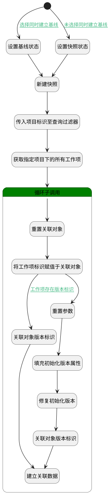

## 新建规划快照 <!-- {docsify-ignore-all} -->

   新建规划快照

### 处理过程




### 处理步骤说明

#### 开始 :id=Begin<sup class="footnote-symbol"> <font color=gray size=1>[开始]</font></sup>


*- N/A*
#### 设置基线状态 :id=PREPAREPARAM7<sup class="footnote-symbol"> <font color=gray size=1>[准备参数]</font></sup>


1. 将`1` 设置给  `baseline(基线对象).STATUS(状态)`

#### 设置快照状态 :id=PREPAREPARAM6<sup class="footnote-symbol"> <font color=gray size=1>[准备参数]</font></sup>


1. 将`3` 设置给  `baseline(基线对象).STATUS(状态)`

#### 新建快照 :id=DEACTION3<sup class="footnote-symbol"> <font color=gray size=1>[实体行为]</font></sup>


调用实体 [基线(BASELINE)](module/Base/baseline.md) 行为 [Create](module/Base/baseline#行为) ，行为参数为`baseline(基线对象)`

将执行结果返回给参数`baseline(基线对象)`

#### 传入项目标识至查询过滤器 :id=PREPAREPARAM1<sup class="footnote-symbol"> <font color=gray size=1>[准备参数]</font></sup>


1. 将`Default(传入变量).PROJECT_ID(项目)` 设置给  `filter(工作项查询过滤器).n_project_id_eq`
2. 将`10000` 设置给  `filter(工作项查询过滤器).size`

#### 获取指定项目下的所有工作项 :id=DEDATASET1<sup class="footnote-symbol"> <font color=gray size=1>[实体数据集]</font></sup>


调用实体 [工作项(WORK_ITEM)](module/ProjMgmt/work_item.md) 数据集合 [新建规划快照时查询工作项(plan_snapshot)](module/ProjMgmt/work_item#数据集合) ，查询参数为`filter(工作项查询过滤器)`

将执行结果返回给参数`page(工作项分页查询结果变量)`

#### 关联对象版本标识 :id=PREPAREPARAM3<sup class="footnote-symbol"> <font color=gray size=1>[准备参数]</font></sup>


1. 将`for_temp_obj(工作项循环临时变量).CUR_VERSION_ID(当前版本标识)` 设置给  `relation(关联对象).TARGET_VERSION_ID(目标对象版本标识)`

#### 循环子调用 :id=LOOPSUBCALL1<sup class="footnote-symbol"> <font color=gray size=1>[循环子调用]</font></sup>


循环参数`page(工作项分页查询结果变量)`，子循环参数使用`for_temp_obj(工作项循环临时变量)`
#### 重置关联对象 :id=RESETPARAM2<sup class="footnote-symbol"> <font color=gray size=1>[重置参数]</font></sup>


重置参数```relation(关联对象)```
#### 将工作项标识赋值于关联对象 :id=PREPAREPARAM2<sup class="footnote-symbol"> <font color=gray size=1>[准备参数]</font></sup>


1. 将`for_temp_obj(工作项循环临时变量).ID(标识)` 设置给  `relation(关联对象).TARGET_ID(关联目标标识)`
2. 将`work_item` 设置给  `relation(关联对象).TARGET_TYPE(关联目标类型)`
3. 将`baseline` 设置给  `relation(关联对象).PRINCIPAL_TYPE(关联主体类型)`

#### 建立关联数据 :id=DEACTION2<sup class="footnote-symbol"> <font color=gray size=1>[实体行为]</font></sup>


调用实体 [关联(RELATION)](module/Base/relation.md) 行为 [Save](module/Base/relation#行为) ，行为参数为`relation(关联对象)`

将执行结果返回给参数`relation(关联对象)`

#### 重置参数 :id=RESETPARAM1<sup class="footnote-symbol"> <font color=gray size=1>[重置参数]</font></sup>


重置参数```version(版本对象)```
#### 填充初始化版本属性 :id=PREPAREPARAM4<sup class="footnote-symbol"> <font color=gray size=1>[准备参数]</font></sup>


1. 将`for_temp_obj(工作项循环临时变量).ID(标识)` 设置给  `version(版本对象).OWNER_ID(所属数据标识)`
2. 将`v1` 设置给  `version(版本对象).NAME(名称)`
3. 将`初始化创建` 设置给  `version(版本对象).DESCRIPTION(描述)`

#### 修复初始化版本 :id=DEACTION1<sup class="footnote-symbol"> <font color=gray size=1>[实体行为]</font></sup>


调用实体 [版本(VERSION)](module/Base/version.md) 行为 [修复版本(FixCommit)](module/Base/version#行为) ，行为参数为`version(版本对象)`

将执行结果返回给参数`version(版本对象)`

#### 关联对象版本标识 :id=PREPAREPARAM5<sup class="footnote-symbol"> <font color=gray size=1>[准备参数]</font></sup>


1. 将`version(版本对象).ID(标识)` 设置给  `relation(关联对象).TARGET_VERSION_ID(目标对象版本标识)`


### 连接条件说明
#### 选择同时建立基线 :id=Begin-PREPAREPARAM7

`baseline(基线对象).set_baseline` ISNOTNULL
#### 工作项存在版本标识 :id=PREPAREPARAM2-PREPAREPARAM3

`for_temp_obj(工作项循环临时变量).CUR_VERSION_ID(当前版本标识)` ISNOTNULL
#### 未选择同时建立基线 :id=Begin-PREPAREPARAM6

`baseline(基线对象).set_baseline` ISNULL


### 实体逻辑参数

|    中文名   |    代码名    |  数据类型    |  实体   |备注 |
| --------| --------| -------- | -------- | --------   |
|传入变量(<i class="fa fa-check"/></i>)|Default|数据对象|[工作项(WORK_ITEM)](module/ProjMgmt/work_item.md)||
|基线对象|baseline|数据对象|[基线(BASELINE)](module/Base/baseline.md)||
|工作项查询过滤器|filter|过滤器|||
|工作项循环临时变量|for_temp_obj|数据对象|[工作项(WORK_ITEM)](module/ProjMgmt/work_item.md)||
|工作项分页查询结果变量|page|分页查询|||
|关联对象|relation|数据对象|[关联(RELATION)](module/Base/relation.md)||
|srfactionparam|srfactionparam|数据对象列表|[基线(BASELINE)](module/Base/baseline.md)||
|版本对象|version|数据对象|[版本(VERSION)](module/Base/version.md)||
