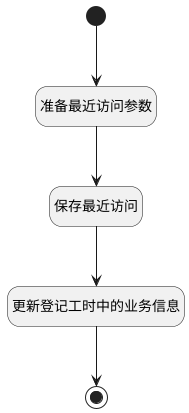

## 生成最近访问 <!-- {docsify-ignore-all} -->

   在用户对工作项数据进行了get或update操作时生成相应的访问记录

### 处理过程




### 处理步骤说明

#### 开始 :id=Begin<sup class="footnote-symbol"> <font color=gray size=1>[开始]</font></sup>


*- N/A*
#### 准备最近访问参数 :id=PREPAREPARAM1<sup class="footnote-symbol"> <font color=gray size=1>[准备参数]</font></sup>


1. 将`Default(传入变量).ID(标识)` 设置给  `recent.OWNER_ID(所属数据标识)`
2. 将`Default(传入变量).PROJECT_IDENTIFIER(项目标识)` 设置给  `recent.RECENT_PARENT_IDENTIFIER(访问父类编号)`
3. 将`Default(传入变量).PROJECT_NAME(所属项目)` 设置给  `recent.RECENT_PARENT_NAME(访问父类名称)`
4. 将`Default(传入变量).PROJECT_ID(项目)` 设置给  `recent.RECENT_PARENT(访问父类)`
5. 将`用户全局对象.srfpersonid` 设置给  `recent.CREATE_MAN(建立人)`
6. 将`Default(传入变量).IDENTIFIER(编号)` 设置给  `recent.IDENTIFIER(编号)`
7. 将`2` 设置给  `recent.TYPE(访问类型)`
8. 将`Default(传入变量).TITLE(标题)` 设置给  `recent.NAME(名称)`
9. 将`project` 设置给  `recent.OWNER_TYPE(所属数据对象)`
10. 将`work_item` 设置给  `recent.OWNER_SUBTYPE(所属对象子类型)`

#### 保存最近访问 :id=DEACTION1<sup class="footnote-symbol"> <font color=gray size=1>[实体行为]</font></sup>


调用实体 [最近访问(RECENT)](module/Base/recent.md) 行为 [Save](module/Base/recent#行为) ，行为参数为`recent`

#### 更新登记工时中的业务信息 :id=RAWSQLCALL1<sup class="footnote-symbol"> <font color=gray size=1>[直接SQL调用]</font></sup>


<p class="panel-title"><b>执行sql语句</b></p>

```sql
UPDATE `WORKLOAD` SET IDENTIFIER = ?, RECENT_PARENT = ?, RECENT_PARENT_IDENTIFIER = ?, RECENT_PARENT_NAME= ?, `NAME` = ?
WHERE PRINCIPAL_ID = ? and PRINCIPAL_TYPE = 'WORK_ITEM'
```

<p class="panel-title"><b>执行sql参数</b></p>

1. `Default(传入变量).IDENTIFIER(编号)`
2. `Default(传入变量).PROJECT_ID(项目)`
3. `Default(传入变量).PROJECT_IDENTIFIER(项目标识)`
4. `Default(传入变量).PROJECT_NAME(所属项目)`
5. `Default(传入变量).TITLE(标题)`
6. `Default(传入变量).ID(标识)`


#### 结束 :id=END1<sup class="footnote-symbol"> <font color=gray size=1>[结束]</font></sup>


*- N/A*


### 实体逻辑参数

|    中文名   |    代码名    |  数据类型    |  实体   |备注 |
| --------| --------| -------- | -------- | --------   |
|传入变量(<i class="fa fa-check"/></i>)|Default|数据对象|[工作项(WORK_ITEM)](module/ProjMgmt/work_item.md)||
|预估工时动态存储对象|extend_storage|数据对象|[扩展存储(EXTEND_STORAGE)](module/Base/extend_storage.md)||
|recent|recent|数据对象|[最近访问(RECENT)](module/Base/recent.md)||
