## 缺陷每日趋势 <!-- {docsify-ignore-all} -->

   报表缺陷每日趋势数据源

### 处理过程

```plantuml
@startuml
hide empty description
<style>
root {
  HyperlinkColor #42b983
}
</style>

hide empty description
state "开始" as Begin <<start>> [[$./defect_daily_trend#begin {"开始"}]]
state "结束" as END1 <<end>> [[$./defect_daily_trend#end1 {"结束"}]]
state "直接SQL调用" as RAWSQLCALL1  [[$./defect_daily_trend#rawsqlcall1 {"直接SQL调用"}]]


Begin --> RAWSQLCALL1
RAWSQLCALL1 --> END1


@enduml
```




### 处理步骤说明

#### 开始 :id=Begin<sup class="footnote-symbol"> <font color=gray size=1>[开始]</font></sup>


*- N/A*
#### 结束 :id=END1<sup class="footnote-symbol"> <font color=gray size=1>[结束]</font></sup>


返回 `result(结果)`

#### 直接SQL调用 :id=RAWSQLCALL1<sup class="footnote-symbol"> <font color=gray size=1>[直接SQL调用]</font></sup>


<p class="panel-title"><b>执行sql语句</b></p>

```sql
SELECT
    date_series.date AS filter_type,
    IFNULL(b.new_bugs, 0) AS count,
    IFNULL(c.completed_bugs, 0) AS count2
FROM (
         SELECT DATE_ADD(?, INTERVAL seq.seq DAY) AS date
         FROM (
                  SELECT a.i+b.i*10+c.i*100 AS seq
                  FROM (SELECT 0 AS i UNION SELECT 1 UNION SELECT 2 UNION SELECT 3 UNION SELECT 4 UNION SELECT 5 UNION SELECT 6 UNION SELECT 7 UNION SELECT 8 UNION SELECT 9) a,
                       (SELECT 0 AS i UNION SELECT 1 UNION SELECT 2 UNION SELECT 3 UNION SELECT 4 UNION SELECT 5 UNION SELECT 6 UNION SELECT 7 UNION SELECT 8 UNION SELECT 9) b,
                       (SELECT 0 AS i UNION SELECT 1 UNION SELECT 2 UNION SELECT 3 UNION SELECT 4 UNION SELECT 5 UNION SELECT 6 UNION SELECT 7 UNION SELECT 8 UNION SELECT 9) c
              ) seq
         WHERE DATE_ADD(?, INTERVAL seq.seq DAY) <= ?
     ) date_series
         LEFT JOIN (
    SELECT
        DATE(CREATE_TIME) AS created_date,
        COUNT(*) AS new_bugs
    FROM work_item
    WHERE CREATE_TIME BETWEEN ? AND ?
      AND WORK_ITEM_TYPE_ID like '%bug%'
      AND ((? IS NULL OR ? = '') OR BOARD_ID = ?)
      AND ((? IS NULL OR ? = '') OR SPRINT_ID = ?)
      AND ((? IS NULL OR ? = '') OR FIND_IN_SET(PRIORITY, ?))
      AND ((? IS NULL OR ? = '') OR FIND_IN_SET(SEVERITY, ?))
    GROUP BY created_date
) b ON date_series.date = b.created_date
         LEFT JOIN (
    SELECT
        DATE(UPDATE_TIME) AS update_date,
        COUNT(*) AS completed_bugs
    FROM work_item
    WHERE UPDATE_TIME BETWEEN ? AND ?
      AND WORK_ITEM_TYPE_ID like '%bug%'
      AND STATE = '40'
      AND ((? IS NULL OR ? = '') OR BOARD_ID = ?)
      AND ((? IS NULL OR ? = '') OR SPRINT_ID = ?)
      AND ((? IS NULL OR ? = '') OR FIND_IN_SET(PRIORITY, ?))
      AND ((? IS NULL OR ? = '') OR FIND_IN_SET(SEVERITY, ?))
    GROUP BY update_date
) c ON date_series.date = c.update_date
ORDER BY date_series.date;
```

<p class="panel-title"><b>执行sql参数</b></p>

1. `Default(传入变量).n_create_time_gtandeq`
2. `Default(传入变量).n_create_time_gtandeq`
3. `Default(传入变量).n_create_time_ltandeq`
4. `Default(传入变量).n_create_time_gtandeq`
5. `Default(传入变量).n_create_time_ltandeq`
6. `Default(传入变量).n_board_id_eq`
7. `Default(传入变量).n_board_id_eq`
8. `Default(传入变量).n_board_id_eq`
9. `Default(传入变量).n_sprint_id_eq`
10. `Default(传入变量).n_sprint_id_eq`
11. `Default(传入变量).n_sprint_id_eq`
12. `Default(传入变量).n_priority_eq`
13. `Default(传入变量).n_priority_eq`
14. `Default(传入变量).n_priority_eq`
15. `Default(传入变量).n_severity_eq`
16. `Default(传入变量).n_severity_eq`
17. `Default(传入变量).n_severity_eq`
18. `Default(传入变量).n_create_time_gtandeq`
19. `Default(传入变量).n_create_time_ltandeq`
20. `Default(传入变量).n_board_id_eq`
21. `Default(传入变量).n_board_id_eq`
22. `Default(传入变量).n_board_id_eq`
23. `Default(传入变量).n_sprint_id_eq`
24. `Default(传入变量).n_sprint_id_eq`
25. `Default(传入变量).n_sprint_id_eq`
26. `Default(传入变量).n_priority_eq`
27. `Default(传入变量).n_priority_eq`
28. `Default(传入变量).n_priority_eq`
29. `Default(传入变量).n_severity_eq`
30. `Default(传入变量).n_severity_eq`
31. `Default(传入变量).n_severity_eq`

重置参数`result(结果)`，并将执行sql结果赋值给参数`result(结果)`


### 实体逻辑参数

|    中文名   |    代码名    |  数据类型    |  实体   |备注 |
| --------| --------| -------- | -------- | --------   |
|传入变量(<i class="fa fa-check"/></i>)|Default|过滤器|||
|结果|result|数据对象列表|||
