## 缺陷累计趋势查询 <!-- {docsify-ignore-all} -->

   报表缺陷累计趋势报表数据源

### 处理过程

```plantuml
@startuml
hide empty description
<style>
root {
  HyperlinkColor #42b983
}
</style>

hide empty description
state "开始" as Begin <<start>> [[$./defect_total_trend#begin {"开始"}]]
state "结束" as END1 <<end>> [[$./defect_total_trend#end1 {"结束"}]]
state "查询每日新增缺陷累计" as RAWSQLCALL1  [[$./defect_total_trend#rawsqlcall1 {"查询每日新增缺陷累计"}]]


Begin --> RAWSQLCALL1
RAWSQLCALL1 --> END1


@enduml
```




### 处理步骤说明

#### 开始 :id=Begin<sup class="footnote-symbol"> <font color=gray size=1>[开始]</font></sup>


*- N/A*
#### 结束 :id=END1<sup class="footnote-symbol"> <font color=gray size=1>[结束]</font></sup>


返回 `result(结果)`

#### 查询每日新增缺陷累计 :id=RAWSQLCALL1<sup class="footnote-symbol"> <font color=gray size=1>[直接SQL调用]</font></sup>


<p class="panel-title"><b>执行sql语句</b></p>

```sql
SELECT
    date_series.date AS filter_type,
    (
        SELECT COUNT(*)
        FROM work_item wi
                 JOIN work_item_state wis ON wi.state = wis.ID
        WHERE DATE(wi.CREATE_TIME) <= date_series.date
          AND wi.WORK_ITEM_TYPE_ID LIKE '%bug%'
          AND wi.PROJECT_ID = ?
          AND ((? IS NULL OR ? = '') OR SPRINT_ID = ?)
          AND ((? IS NULL OR ? = '') OR FIND_IN_SET(PRIORITY, ?))
          AND ((? IS NULL OR ? = '') OR FIND_IN_SET(SEVERITY, ?))
          AND wi.is_deleted = 0
    ) AS count,
    (
        SELECT COUNT(*)
        FROM work_item wi
                 JOIN work_item_state wis ON wi.state = wis.ID
        WHERE DATE(wi.CREATE_TIME) <= date_series.date
          AND wi.WORK_ITEM_TYPE_ID LIKE '%bug%'
          AND wi.PROJECT_ID = ?
          AND ((? IS NULL OR ? = '') OR SPRINT_ID = ?)
          AND ((? IS NULL OR ? = '') OR FIND_IN_SET(PRIORITY, ?))
          AND ((? IS NULL OR ? = '') OR FIND_IN_SET(SEVERITY, ?))
          AND wi.is_deleted = 0
          AND wis.TYPE <> 'completed'
    ) AS count2
FROM
    (SELECT ? + INTERVAL seq.seq DAY AS date
     FROM
         (SELECT a.i + b.i*10 + c.i*100 AS seq
          FROM (SELECT 0 AS i UNION SELECT 1 UNION SELECT 2 UNION SELECT 3 UNION SELECT 4 UNION SELECT 5 UNION SELECT 6 UNION SELECT 7 UNION SELECT 8 UNION SELECT 9) a
                   CROSS JOIN (SELECT 0 AS i UNION SELECT 1 UNION SELECT 2 UNION SELECT 3 UNION SELECT 4 UNION SELECT 5 UNION SELECT 6 UNION SELECT 7 UNION SELECT 8 UNION SELECT 9) b
                   CROSS JOIN (SELECT 0 AS i UNION SELECT 1 UNION SELECT 2 UNION SELECT 3 UNION SELECT 4 UNION SELECT 5 UNION SELECT 6 UNION SELECT 7 UNION SELECT 8 UNION SELECT 9) c
         ) seq
     WHERE ? + INTERVAL seq.seq DAY <= ?
    ) date_series
ORDER BY date_series.date;
```

<p class="panel-title"><b>执行sql参数</b></p>

1. `Default(传入变量).n_project_id_eq`
2. `Default(传入变量).N_SPRINT_ID_EQ`
3. `Default(传入变量).N_SPRINT_ID_EQ`
4. `Default(传入变量).N_SPRINT_ID_EQ`
5. `Default(传入变量).N_PRIORITY_EQ`
6. `Default(传入变量).N_PRIORITY_EQ`
7. `Default(传入变量).N_PRIORITY_EQ`
8. `Default(传入变量).N_SEVERITY_EQ`
9. `Default(传入变量).N_SEVERITY_EQ`
10. `Default(传入变量).N_SEVERITY_EQ`
11. `Default(传入变量).n_project_id_eq`
12. `Default(传入变量).N_SPRINT_ID_EQ`
13. `Default(传入变量).N_SPRINT_ID_EQ`
14. `Default(传入变量).N_SPRINT_ID_EQ`
15. `Default(传入变量).N_PRIORITY_EQ`
16. `Default(传入变量).N_PRIORITY_EQ`
17. `Default(传入变量).N_PRIORITY_EQ`
18. `Default(传入变量).N_SEVERITY_EQ`
19. `Default(传入变量).N_SEVERITY_EQ`
20. `Default(传入变量).N_SEVERITY_EQ`
21. `Default(传入变量).n_create_time_gtandeq`
22. `Default(传入变量).n_create_time_gtandeq`
23. `Default(传入变量).n_create_time_ltandeq`

重置参数`result(结果)`，并将执行sql结果赋值给参数`result(结果)`


### 实体逻辑参数

|    中文名   |    代码名    |  数据类型    |  实体   |备注 |
| --------| --------| -------- | -------- | --------   |
|传入变量(<i class="fa fa-check"/></i>)|Default|过滤器|||
|结果|result|数据对象列表|||
