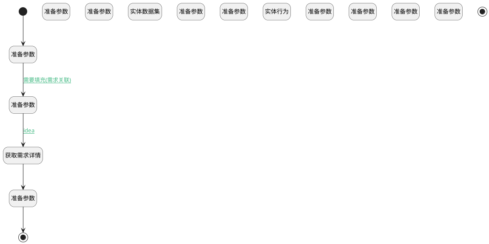

## 填充表单 <!-- {docsify-ignore-all} -->

   

### 处理过程

### 处理步骤说明

#### 开始 :id=Begin [开始]

*- N/A*
#### 结束 :id=END1 [结束]

返回 `draft_data(草稿数据)`

#### 准备参数 :id=PREPAREPARAM9 [准备参数]

    无

#### 准备参数 :id=PREPAREPARAM1 [准备参数]

1. 将`Default(传入变量).fill_id` 设置给  `fill_obj(填充对象).ID(标识)`

#### 获取需求详情 :id=DEACTION1 [实体行为]

调用实体 [需求(IDEA)](module/ProdMgmt/idea.md) 行为 [Get](module/ProdMgmt/idea#行为) ，行为参数为`fill_obj(填充对象)`

#### 准备参数 :id=PREPAREPARAM2 [准备参数]

1. 将`fill_obj(填充对象).TITLE(标题)` 设置给  `Default(传入变量).TITLE(标题)`
2. 将`fill_obj(填充对象).DESCRIPTION(描述)` 设置给  `Default(传入变量).DESCRIPTION(描述)`

#### 准备参数 :id=PREPAREPARAM11 [准备参数]

    无

#### 准备参数 :id=PREPAREPARAM3 [准备参数]

1. 将`1` 设置给  `recent_filter(最近访问过滤器).SIZE`
2. 将`1` 设置给  `recent_filter(最近访问过滤器).N_TYPE_EQ`

#### 实体数据集 :id=DEDATASET1 [实体数据集]

调用实体 [最近访问(RECENT)](module/Base/recent.md) 数据集合 [最近访问项目(recent_project)](module/Base/recent#数据集合) ，查询参数为`recent_filter(最近访问过滤器)`

将执行结果返回给参数`recent_page(最近访问分页结果)`

#### 准备参数 :id=PREPAREPARAM4 [准备参数]

1. 将`recent_page(最近访问分页结果).0` 绑定给  `recent_obj(最近访问对象)`
2. 将`recent_obj(最近访问对象).RECENT_PARENT_NAME(访问父类名称)` 设置给  `Default(传入变量).PROJECT_NAME(所属项目)`
3. 将`recent_obj(最近访问对象).OWNER_ID(所属数据标识)` 设置给  `Default(传入变量).PROJECT_ID(项目)`

#### 准备参数 :id=PREPAREPARAM10 [准备参数]

1. 将`recent_obj(最近访问对象).OWNER_ID(所属数据标识)` 设置给  `project_data(项目数据).ID(标识)`

#### 实体行为 :id=DEACTION2 [实体行为]

调用实体 [项目(PROJECT)](module/ProjMgmt/project.md) 行为 [Get](module/ProjMgmt/project#行为) ，行为参数为`project_data(项目数据)`

将执行结果返回给参数`project_data(项目数据)`

#### 准备参数 :id=PREPAREPARAM5 [准备参数]

1. 将`scrum_epic` 设置给  `Default(传入变量).WORK_ITEM_TYPE_ID(工作项类型)`
2. 将`project_data(项目数据).NAME(项目名称)` 设置给  `Default(传入变量).PROJECT_NAME(所属项目)`
3. 将`史诗` 设置给  `Default(传入变量).WORK_ITEM_TYPE_NAME(工作项类型)`

#### 准备参数 :id=PREPAREPARAM6 [准备参数]

1. 将`kanban_epic` 设置给  `Default(传入变量).WORK_ITEM_TYPE_ID(工作项类型)`
2. 将`project_data(项目数据).NAME(项目名称)` 设置给  `Default(传入变量).PROJECT_NAME(所属项目)`
3. 将`史诗` 设置给  `Default(传入变量).WORK_ITEM_TYPE_NAME(工作项类型)`

#### 准备参数 :id=PREPAREPARAM7 [准备参数]

1. 将`waterfall_stage` 设置给  `Default(传入变量).WORK_ITEM_TYPE_ID(工作项类型)`
2. 将`project_data(项目数据).NAME(项目名称)` 设置给  `Default(传入变量).PROJECT_NAME(所属项目)`
3. 将`阶段` 设置给  `Default(传入变量).WORK_ITEM_TYPE_NAME(工作项类型)`

#### 准备参数 :id=PREPAREPARAM8 [准备参数]

1. 将`hybrid_epic` 设置给  `Default(传入变量).WORK_ITEM_TYPE_ID(工作项类型)`
2. 将`project_data(项目数据).NAME(项目名称)` 设置给  `Default(传入变量).PROJECT_NAME(所属项目)`
3. 将`史诗` 设置给  `Default(传入变量).WORK_ITEM_TYPE_NAME(工作项类型)`

#### 结束 :id=END2 [结束]

返回 `Default(传入变量)`

### 连接条件说明
#### 需要填充(需求关联) :id=PREPAREPARAM9-PREPAREPARAM1

`Default(传入变量).need_fill` EQ `true`
#### idea :id=PREPAREPARAM1-DEACTION1

`Default(传入变量).fill_type` EQ `idea`

### 实体逻辑参数

|    中文名   |    代码名    |  数据类型    |  实体   |备注 |
| --------| --------| -------- | -------- | --------   |
|传入变量(<i class="fa fa-check"/></i>)|Default|数据对象|[工作项(WORK_ITEM)](module/ProjMgmt/work_item.md)||
|草稿数据|draft_data|数据对象|[工作项(WORK_ITEM)](module/ProjMgmt/work_item.md)||
|填充对象|fill_obj|数据对象|[工作项(WORK_ITEM)](module/ProjMgmt/work_item.md)||
|项目数据|project_data|数据对象|[项目(PROJECT)](module/ProjMgmt/project.md)||
|最近访问过滤器|recent_filter|过滤器|||
|最近访问对象|recent_obj|数据对象|[最近访问(RECENT)](module/Base/recent.md)||
|最近访问分页结果|recent_page|分页查询|||
