## 填充待完成事项数量 <!-- {docsify-ignore-all} -->

   移动端工作台首页：获取待完成事项数量

### 处理过程

```plantuml
@startuml
hide empty description
<style>
root {
  HyperlinkColor #42b983
}
</style>

hide empty description
state "开始" as Begin <<start>> [[$./fill_not_completed_num#begin {"开始"}]]
state "获取待完成事项数量" as RAWSQLCALL1  [[$./fill_not_completed_num#rawsqlcall1 {"获取待完成事项数量"}]]
state "结束" as END1 <<end>> [[$./fill_not_completed_num#end1 {"结束"}]]


Begin --> RAWSQLCALL1
RAWSQLCALL1 --> END1


@enduml
```




### 处理步骤说明

#### 开始 :id=Begin<sup class="footnote-symbol"> <font color=gray size=1>[开始]</font></sup>


*- N/A*
#### 获取待完成事项数量 :id=RAWSQLCALL1<sup class="footnote-symbol"> <font color=gray size=1>[直接SQL调用]</font></sup>


<p class="panel-title"><b>执行sql语句</b></p>

```sql
SELECT count(1) as `not_completed_num`
FROM `WORK_ITEM` t1 
LEFT JOIN `WORK_ITEM_STATE` t31 ON t1.`STATE` = t31.`ID` 
WHERE 
( t1.`ASSIGNEE_ID` = ?  AND  t1.`IS_ARCHIVED` = 0  AND  t1.`IS_DELETED` = 0  AND  t31.`TYPE` <> 'completed' )
```

<p class="panel-title"><b>执行sql参数</b></p>

1. `用户全局对象.srfpersonid`

重置参数`Default(传入变量)`，并将执行sql结果赋值给参数`Default(传入变量)`

#### 结束 :id=END1<sup class="footnote-symbol"> <font color=gray size=1>[结束]</font></sup>


返回 `Default(传入变量)`


### 实体逻辑参数

|    中文名   |    代码名    |  数据类型    |  实体   |备注 |
| --------| --------| -------- | -------- | --------   |
|传入变量(<i class="fa fa-check"/></i>)|Default|数据对象|[工作项(WORK_ITEM)](module/ProjMgmt/work_item.md)||
