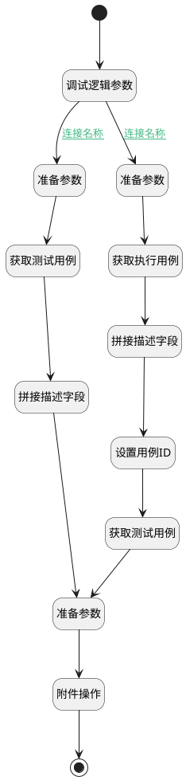

## 填充用例信息 <!-- {docsify-ignore-all} -->

   

### 处理过程




### 处理步骤说明

#### 开始 :id=Begin<sup class="footnote-symbol"> <font color=gray size=1>[开始]</font></sup>


*- N/A*
#### 调试逻辑参数 :id=DEBUGPARAM1<sup class="footnote-symbol"> <font color=gray size=1>[调试逻辑参数]</font></sup>


> [!NOTE|label:调试信息|icon:fa fa-bug]
> 调试输出参数`Default(传入变量)`的详细信息


#### 准备参数 :id=PREPAREPARAM4<sup class="footnote-symbol"> <font color=gray size=1>[准备参数]</font></sup>


1. 将`Default(传入变量).run_id` 设置给  `run(执行用例).ID(标识)`

#### 准备参数 :id=PREPAREPARAM1<sup class="footnote-symbol"> <font color=gray size=1>[准备参数]</font></sup>


1. 将`Default(传入变量).test_case` 设置给  `test_case(用例).ID(标识)`

#### 获取执行用例 :id=DEACTION2<sup class="footnote-symbol"> <font color=gray size=1>[实体行为]</font></sup>


调用实体 [执行用例(RUN)](module/TestMgmt/run.md) 行为 [Get](module/TestMgmt/run#行为) ，行为参数为`run(执行用例)`

将执行结果返回给参数`run(执行用例)`

#### 获取测试用例 :id=DEACTION1<sup class="footnote-symbol"> <font color=gray size=1>[实体行为]</font></sup>


调用实体 [用例(TEST_CASE)](module/TestMgmt/test_case.md) 行为 [Get](module/TestMgmt/test_case#行为) ，行为参数为`test_case(用例)`

将执行结果返回给参数`test_case(用例)`

#### 拼接描述字段 :id=RAWSFCODE1<sup class="footnote-symbol"> <font color=gray size=1>[直接后台代码]</font></sup>


<p class="panel-title"><b>执行代码[Groovy]</b></p>

```groovy
def _default = logic.param('Default').getReal();
def test_case = logic.param('test_case').getReal();

def table_start = '<table style="width: auto;"><tbody><tr><th colSpan="1" rowSpan="1" width="56.32">#</th><th colSpan="1" rowSpan="1" width="auto">步骤描述</th><th colSpan="1" rowSpan="1" width="auto">预期结果</th></tr>';
def table_end = '</tbody></table>';
def steps = test_case.get('steps');
def text = '<p><strong>前置条件：</strong></p>' + (test_case.get('precondition') ?: '') + '<p><strong>执行步骤：</strong></p>' + table_start;


def content = '<td colSpan="1" rowSpan="1" width="auto">';
def group = '<td colSpan="4" rowSpan="1" width="auto">';

def order = 1;
def group_order = 0.1;
steps.each { item ->
    println item;
    if(item.get('is_group') == 0){
        text += '<tr>' + content + order + '</td>';
        text += content;
        text += (item.get('description') ?: '') + '</td>';
        text += content;
        text += (item.get('expected_value') ?: '') + '</td>' + '</tr>';
    }else if(item.get('is_group') == 1){
        text += '<tr>' + content + order + '</td>';
        text += group;
        text += (item.get('name') ?: '') + '</td>' + '</tr>';
        group_order = 0.1;
    }else{
        group_order += order;
        text += '<tr>' + content + group_order + '</td>';
        text += content;
        text += (item.get('description') ?: '') + '</td>';
        text += content;
        text += (item.get('expected_value') ?: '') + '</td>' + '</tr>';
        group_order += 0.1;
    }
    order++;
}
text += table_end + (_default.get('description') ?: '');

_default.set('description', text);
```

#### 拼接描述字段 :id=RAWSFCODE2<sup class="footnote-symbol"> <font color=gray size=1>[直接后台代码]</font></sup>


<p class="panel-title"><b>执行代码[Groovy]</b></p>

```groovy
def _default = logic.param('Default').getReal();
def run = logic.param('run').getReal();

//获取代码表
def run_status = sys.codelist('TestMgmt__run_status');


def table_start = '<table style="width: auto;"><tbody><tr><th colSpan="1" rowSpan="1" width="55">#</th><th colSpan="1" rowSpan="1" width="auto">步骤描述</th><th colSpan="1" rowSpan="1" width="auto">预期结果</th><th colSpan="1" rowSpan="1" width="auto">实际结果</th><th colSpan="1" rowSpan="1" width="80">执行结果</th></tr>';
def table_end = '</tbody></table>';
def steps = run.get('steps');
def text = '<p><strong>前置条件：</strong></p>' + (run.get('precondition') ?: '') + '<p><strong>执行步骤：</strong></p>' + table_start;


def content = '<td colSpan="1" rowSpan="1" width="auto">';
def group = '<td colSpan="4" rowSpan="1" width="auto">';

def order = 1;
def group_order = 0.1;
steps.each { item ->
    println item;
    if(item.get('is_group') == 0){
        text += '<tr>' + content + order + '</td>';
        text += content;
        text += (item.get('description') ?: '') + '</td>';
        text += content;
        text += (item.get('expected_value') ?: '') + '</td>';
        text += content;
        text += (item.get('actual_value') ?: '') + '</td>';
        text += content;
        text += (run_status.getText(item.get('status1'))) ?: '' + '</td>' + '</tr>';
    }else if(item.get('is_group') == 1){
        text += '<tr>' + content + order + '</td>';
        text += group;
        text += (item.get('name') ?: '') + '</td>' + '</tr>';
        group_order = 0.1;
    }else{
        group_order += order;
        text += '<tr>' + content + group_order + '</td>';
        text += content;
        text += (item.get('description') ?: '') + '</td>';
        text += content;
        text += (item.get('expected_value') ?: '') + '</td>';
        text += content;
        text += (item.get('actual_value') ?: '') + '</td>';
        text += content;
        text += (run_status.getText(item.get('status1'))) ?: '' + '</td>' + '</tr>';
        group_order += 0.1;
    }
    order++;
}
text += table_end + (_default.get('description') ?: '');

_default.set('description', text);
```

#### 设置用例ID :id=PREPAREPARAM6<sup class="footnote-symbol"> <font color=gray size=1>[准备参数]</font></sup>


1. 将`run(执行用例).CASE_ID(测试用例标识)` 设置给  `test_case(用例).ID(标识)`

#### 准备参数 :id=PREPAREPARAM5<sup class="footnote-symbol"> <font color=gray size=1>[准备参数]</font></sup>


1. 将`test_case(用例).ATTACHMENTS(附件)` 绑定给  `attachments(附件列表)`

#### 获取测试用例 :id=DEACTION3<sup class="footnote-symbol"> <font color=gray size=1>[实体行为]</font></sup>


调用实体 [用例(TEST_CASE)](module/TestMgmt/test_case.md) 行为 [Get](module/TestMgmt/test_case#行为) ，行为参数为`test_case(用例)`

将执行结果返回给参数`test_case(用例)`

#### 附件操作 :id=RAWSFCODE3<sup class="footnote-symbol"> <font color=gray size=1>[直接后台代码]</font></sup>


<p class="panel-title"><b>执行代码[Groovy]</b></p>

```groovy
def _default = logic.param('Default').getReal();
def attachments = logic.param('attachments').getReal();

def _default_list = _default.get('attachments');
def list = new ArrayList();

attachments.each { item ->
    println item;
    item.set('owner_id',null);
    item.set('owner_type',null);
    item.set('id',null);
    list.add(item);
}

_default_list.each { item ->
    println item;
    list.add(item);
}
println list;
_default.set('attachments', list);
```

#### 结束 :id=END1<sup class="footnote-symbol"> <font color=gray size=1>[结束]</font></sup>


返回 `Default(传入变量)`


### 连接条件说明
#### 连接名称 :id=DEBUGPARAM1-PREPAREPARAM1

`Default(传入变量).test_case` ISNOTNULL
#### 连接名称 :id=DEBUGPARAM1-PREPAREPARAM4

`Default(传入变量).run_id` ISNOTNULL


### 实体逻辑参数

|    中文名   |    代码名    |  数据类型    |  实体   |备注 |
| --------| --------| -------- | -------- | --------   |
|传入变量(<i class="fa fa-check"/></i>)|Default|数据对象|[工作项(WORK_ITEM)](module/ProjMgmt/work_item.md)||
|附件列表|attachments|数据对象列表|||
|执行用例|run|数据对象|[执行用例(RUN)](module/TestMgmt/run.md)||
|用例|test_case|数据对象|[用例(TEST_CASE)](module/TestMgmt/test_case.md)||
