## 填充状态的类型 <!-- {docsify-ignore-all} -->

   根据工作项状态的id获取对应的type值

### 处理过程

```plantuml
@startuml
hide empty description
<style>
root {
  HyperlinkColor #42b983
}
</style>

hide empty description
state "开始" as Begin <<start>> [[$./fill_type_of_state#begin {"开始"}]]
state "结束" as END1 <<end>> [[$./fill_type_of_state#end1 {"结束"}]]
state "准备id" as PREPAREPARAM1  [[$./fill_type_of_state#prepareparam1 {"准备id"}]]
state "获取工作项状态" as DEACTION1  [[$./fill_type_of_state#deaction1 {"获取工作项状态"}]]
state "设置工作项状态" as PREPAREPARAM2  [[$./fill_type_of_state#prepareparam2 {"设置工作项状态"}]]


Begin --> PREPAREPARAM1
PREPAREPARAM1 --> DEACTION1
DEACTION1 --> PREPAREPARAM2
PREPAREPARAM2 --> END1


@enduml
```

### 处理步骤说明

#### 开始 :id=Begin [开始]

*- N/A*
#### 结束 :id=END1 [结束]

返回 `item_state(工作项状态)`

#### 准备id :id=PREPAREPARAM1 [准备参数]

1. 将`Default(传入变量).state(状态)` 设置给  `item_state(工作项状态).ID(标识)`

#### 获取工作项状态 :id=DEACTION1 [实体行为]

调用实体 [工作项状态(WORK_ITEM_STATE)](module/ProjMgmt/work_item_state.md) 行为 [Get](module/ProjMgmt/work_item_state#行为) ，行为参数为`item_state(工作项状态)`

将执行结果返回给参数`item_state(工作项状态)`

#### 设置工作项状态 :id=PREPAREPARAM2 [准备参数]

1. 将`item_state(工作项状态).TYPE(状态类型)` 设置给  `item_state(工作项状态).type_of_state`

### 实体逻辑参数

|    中文名   |    代码名    |  数据类型    |  实体   |备注 |
| --------| --------| -------- | -------- | --------   |
|传入变量(<i class="fa fa-check"/></i>)|Default|数据对象|[工作项(WORK_ITEM)](module/ProjMgmt/work_item.md)||
|工作项状态|item_state|数据对象|[工作项状态(WORK_ITEM_STATE)](module/ProjMgmt/work_item_state.md)||
