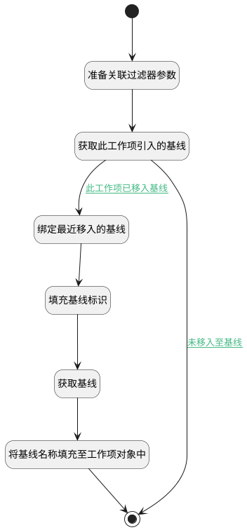

## 获取基线名称 <!-- {docsify-ignore-all} -->

   工作项主视图获取所属基线

### 处理过程

### 处理步骤说明

#### 开始 :id=Begin [开始]

*- N/A*
#### 准备关联过滤器参数 :id=PREPAREPARAM1 [准备参数]

1. 将`work_item` 设置给  `relation_filter(关联查询过滤器).n_target_type_eq`
2. 将`baseline` 设置给  `relation_filter(关联查询过滤器).n_principal_type_eq`
3. 将`Default(传入变量).ID(标识)` 设置给  `relation_filter(关联查询过滤器).n_target_id_eq`
4. 将`create_time,desc` 设置给  `relation_filter(关联查询过滤器).sort`
5. 将`Default(传入变量).CUR_VERSION_ID(当前版本标识)` 设置给  `relation_filter(关联查询过滤器).n_target_version_id_eq`

#### 获取此工作项引入的基线 :id=DEDATASET1 [实体数据集]

调用实体 [关联(RELATION)](module/Base/relation.md) 数据集合 [数据集(DEFAULT)](module/Base/relation#数据集合) ，查询参数为`relation_filter(关联查询过滤器)`

将执行结果返回给参数`relation_page(关联查询结果变量)`

#### 绑定最近移入的基线 :id=BINDPARAM1 [绑定参数]

绑定参数`relation_page(关联查询结果变量)` 到 `relation(基线-工作项关联对象)`
#### 填充基线标识 :id=PREPAREPARAM2 [准备参数]

1. 将`relation(基线-工作项关联对象).PRINCIPAL_ID(关联主体标识)` 设置给  `baseline(基线).ID(标识)`

#### 获取基线 :id=DEACTION2 [实体行为]

调用实体 [基线(BASELINE)](module/Base/baseline.md) 行为 [Get](module/Base/baseline#行为) ，行为参数为`baseline(基线)`

将执行结果返回给参数`baseline(基线)`

#### 将基线名称填充至工作项对象中 :id=PREPAREPARAM3 [准备参数]

1. 将`baseline(基线).NAME(名称)` 设置给  `Default(传入变量).baseline_name`

#### 结束 :id=END1 [结束]

返回 `Default(传入变量)`

### 连接条件说明
#### 此工作项已移入基线 :id=DEDATASET1-BINDPARAM1

`relation_page(关联查询结果变量).size` GT `0`
#### 未移入至基线 :id=DEDATASET1-END1

`relation_page(关联查询结果变量).size` EQ `0`

### 实体逻辑参数

|    中文名   |    代码名    |  数据类型    |  实体   |备注 |
| --------| --------| -------- | -------- | --------   |
|传入变量(<i class="fa fa-check"/></i>)|Default|数据对象|[工作项(WORK_ITEM)](module/ProjMgmt/work_item.md)||
|基线|baseline|数据对象|[基线(BASELINE)](module/Base/baseline.md)||
|基线-工作项关联对象|relation|数据对象|[关联(RELATION)](module/Base/relation.md)||
|关联查询过滤器|relation_filter|过滤器|||
|关联查询结果变量|relation_page|分页查询|||
