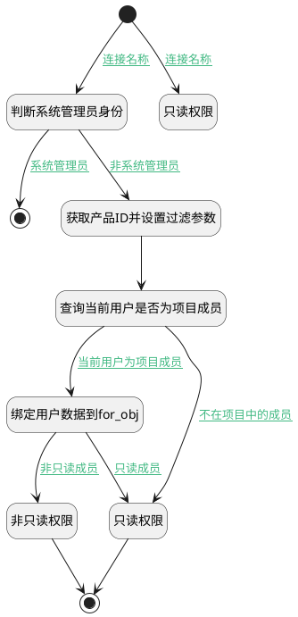

## 获取项目成员 <!-- {docsify-ignore-all} -->

   获取项目成员信息，用于判断当前用户权限

### 处理过程




### 处理步骤说明

#### 绑定用户数据到for_obj :id=PREPAREPARAM5<sup class="footnote-symbol"> <font color=gray size=1>[准备参数]</font></sup>


1. 将`members(成员).0` 绑定给  `for_obj(循环临时变量)`

#### 非只读权限 :id=RAWSFCODE2<sup class="footnote-symbol"> <font color=gray size=1>[直接后台代码]</font></sup>


<p class="panel-title"><b>执行代码[JavaScript]</b></p>

```javascript
var defaultObj = logic.getParam("default");
defaultObj.set("srfreadonly", false);
```

#### 结束 :id=END6<sup class="footnote-symbol"> <font color=gray size=1>[结束]</font></sup>


返回 `Default(传入变量)`

#### 开始 :id=Begin<sup class="footnote-symbol"> <font color=gray size=1>[开始]</font></sup>


*- N/A*
#### 判断系统管理员身份 :id=RAWSFCODE3<sup class="footnote-symbol"> <font color=gray size=1>[直接后台代码]</font></sup>


<p class="panel-title"><b>执行代码[Groovy]</b></p>

```groovy
def _usercontext = sys.user();
def srfreadonly = _usercontext.testSysUniRes("SYSTEM");
def _default = logic.param("default").real;
if(srfreadonly == true){
    _default.set("srfreadonly",false);
}
```

#### 获取产品ID并设置过滤参数 :id=PREPAREPARAM2<sup class="footnote-symbol"> <font color=gray size=1>[准备参数]</font></sup>


1. 将`Default(传入变量).project_id(项目)` 设置给  `filter(过滤器).N_PROJECT_ID_EQ`
2. 将`用户全局对象.srfpersonid` 设置给  `filter(过滤器).N_USER_ID_EQ`

#### 查询当前用户是否为项目成员 :id=DEDATASET3<sup class="footnote-symbol"> <font color=gray size=1>[实体数据集]</font></sup>


调用实体 [项目成员(PROJECT_MEMBER)](module/ProjMgmt/project_member.md) 数据集合 [数据集(DEFAULT)](module/ProjMgmt/project_member#数据集合) ，查询参数为`filter(过滤器)`

将执行结果返回给参数`members(成员)`

#### 只读权限 :id=RAWSFCODE1<sup class="footnote-symbol"> <font color=gray size=1>[直接后台代码]</font></sup>


<p class="panel-title"><b>执行代码[JavaScript]</b></p>

```javascript
var defaultObj = logic.getParam("default");

defaultObj.set("srfreadonly", true);
```

#### 只读权限 :id=RAWSFCODE4<sup class="footnote-symbol"> <font color=gray size=1>[直接后台代码]</font></sup>


<p class="panel-title"><b>执行代码[JavaScript]</b></p>

```javascript
var defaultObj = logic.getParam("default");

defaultObj.set("srfreadonly", true);
```

#### 结束 :id=END2<sup class="footnote-symbol"> <font color=gray size=1>[结束]</font></sup>


*- N/A*


### 连接条件说明
#### 连接名称 :id=Begin-RAWSFCODE3

`Default(传入变量).IS_ARCHIVED(是否已归档)` EQ `0` AND `Default(传入变量).IS_DELETED(是否已删除)` EQ `0`
#### 非系统管理员 :id=RAWSFCODE3-PREPAREPARAM2

`Default(传入变量).srfreadonly` ISNULL
#### 不在项目中的成员 :id=DEDATASET3-RAWSFCODE1

`members(成员).size` EQ `0`
#### 当前用户为项目成员 :id=DEDATASET3-PREPAREPARAM5

`members(成员).size` EQ `1`
#### 非只读成员 :id=PREPAREPARAM5-RAWSFCODE2

`for_obj(循环临时变量).role_id` NOTEQ `reader`
#### 只读成员 :id=PREPAREPARAM5-RAWSFCODE1

`for_obj(循环临时变量).role_id` EQ `reader`
#### 系统管理员 :id=RAWSFCODE3-END2

`Default(传入变量).srfreadonly` EQ `false`
#### 连接名称 :id=Begin-RAWSFCODE4

(`Default(传入变量).IS_ARCHIVED(是否已归档)` EQ `1` OR `Default(传入变量).IS_DELETED(是否已删除)` EQ `1`)


### 实体逻辑参数

|    中文名   |    代码名    |  数据类型    |  实体   |备注 |
| --------| --------| -------- | -------- | --------   |
|传入变量(<i class="fa fa-check"/></i>)|Default|数据对象|[工作项(WORK_ITEM)](module/ProjMgmt/work_item.md)||
|过滤器|filter|过滤器|||
|循环临时变量|for_obj|数据对象|||
|成员|members|分页查询|||
