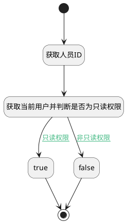

## 获取项目成员 <!-- {docsify-ignore-all} -->

   获取项目成员信息，用于判断当前用户权限

### 处理过程




### 处理步骤说明

#### true :id=PREPAREPARAM5<sup class="footnote-symbol"> <font color=gray size=1>[准备参数]</font></sup>


1. 将`true` 设置给  `user(当前登录人).readonly`

#### 开始 :id=Begin<sup class="footnote-symbol"> <font color=gray size=1>[开始]</font></sup>


*- N/A*
#### 结束 :id=END2<sup class="footnote-symbol"> <font color=gray size=1>[结束]</font></sup>


返回 `user(当前登录人)`

#### 获取人员ID :id=PREPAREPARAM2<sup class="footnote-symbol"> <font color=gray size=1>[准备参数]</font></sup>


1. 将`用户全局对象.srfpersonid` 设置给  `user(当前登录人).USER_ID`

#### 获取当前用户并判断是否为只读权限 :id=RAWSQLCALL1<sup class="footnote-symbol"> <font color=gray size=1>[直接SQL调用]</font></sup>


<p class="panel-title"><b>执行sql语句</b></p>

```sql
SELECT COUNT(1) as read_count FROM project_member t1 where t1.user_id = ? and project_id = ? and (ROLE_ID ='admin' or ROLE_ID = 'user');

```

<p class="panel-title"><b>执行sql参数</b></p>

1. `user(当前登录人).USER_ID`
2. `Default(传入变量).PROJECT_ID(项目)`

重置参数`Default(传入变量)`，并将执行sql结果赋值给参数`Default(传入变量)`

#### false :id=PREPAREPARAM6<sup class="footnote-symbol"> <font color=gray size=1>[准备参数]</font></sup>


1. 将`false` 设置给  `user(当前登录人).readonly`


### 连接条件说明
#### 只读权限 :id=RAWSQLCALL1-PREPAREPARAM5

`Default(传入变量).read_count` EQ `0`
#### 非只读权限 :id=RAWSQLCALL1-PREPAREPARAM6

`Default(传入变量).read_count` EQ `1`


### 实体逻辑参数

|    中文名   |    代码名    |  数据类型    |  实体   |备注 |
| --------| --------| -------- | -------- | --------   |
|传入变量(<i class="fa fa-check"/></i>)|Default|数据对象|[工作项(WORK_ITEM)](module/ProjMgmt/work_item.md)||
|当前登录人|user|数据对象|||
